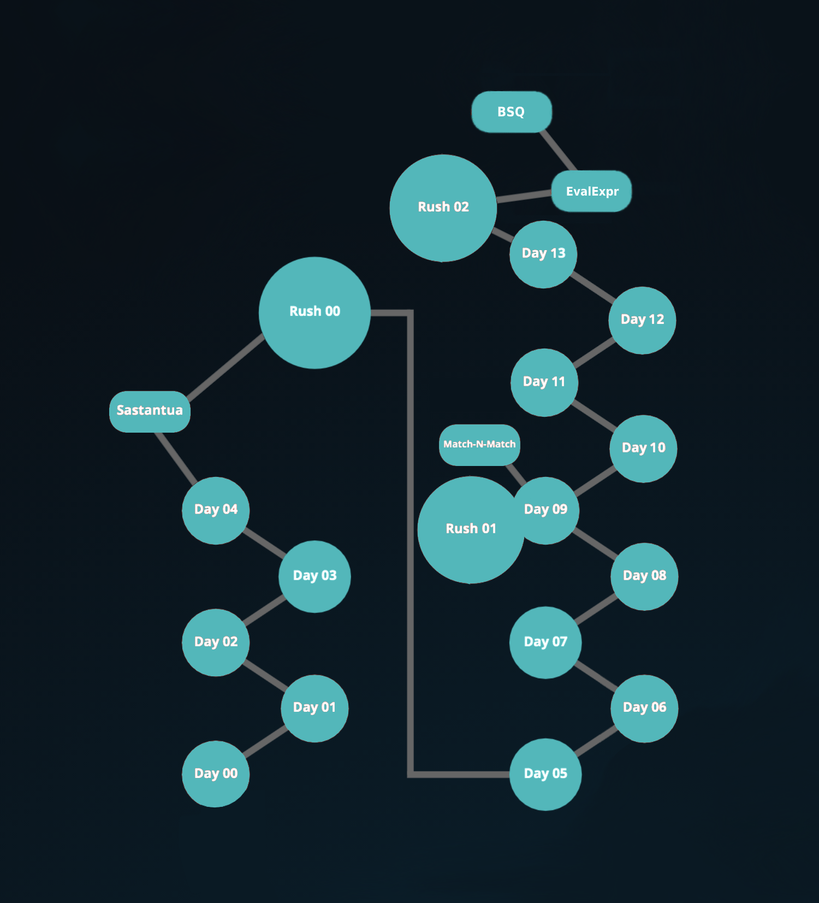

# Бассейн по языку Си #

Именно с этого бассейна начнётся обучение программированию в школе 42.
- Бассейн по Си: [[EN]](https://github.com/evgenkarlson/Subjects___School_42/tree/master/00_Piscine_C_(%D0%98%D1%81%D0%BF%D1%8B%D1%82%D0%B0%D1%82%D0%B5%D0%BB%D1%8C%D0%BD%D1%8B%D0%B9_%D0%91%D0%B0%D1%81%D0%B5%D0%B9%D0%BD_%D0%A8%D0%BA%D0%BE%D0%BB%D1%8B)/readme.md#бассейн-по-языку-си/)
- Экзаменационные задания начального бассейна по Си: [[EN][FR][RO]](https://github.com/evgenkarlson/Subjects___School_42/tree/master/00_Piscine_C_(%D0%98%D1%81%D0%BF%D1%8B%D1%82%D0%B0%D1%82%D0%B5%D0%BB%D1%8C%D0%BD%D1%8B%D0%B9_%D0%91%D0%B0%D1%81%D0%B5%D0%B9%D0%BD_%D0%A8%D0%BA%D0%BE%D0%BB%D1%8B)/Exam_C)
- Готовые и закомментированные решения заданий бассейна по Си: [[RU][EN]](https://github.com/evgenkarlson/Completed___Piscine_C___of___School_42)

Здесь вас будет ждать полное погружение в глубокую часть кода, которое позволит по-настоящему открыть для себя школу, ее уникальный метод обучения и, прежде всего, что такое программирование на самом деле.

Каждый день бассейна Вы будете получать порцию заданий (обычно 10 – 25), выстроенных по нарастающей сложности. И каждый день вы будете проходить новую тему и новые особености языка, которые будете понимать и запоминать выполняя задания этого дня. 

Чтобы помочь в них разобраться вам предоставляются обучающие [[видео]](https://www.youtube.com/playlist?list=PLnI5O9CyX5MFaOvTB1EWSHFC7EzB61UIp) на 10-30 минут с теорией и примерами(используйте в плеере функцию субтитров и их перевода на нужный вам язык), но как правило этого никогда не будет достаточно. По этому всю нужную информацию для обучения вы ищите самостоятельно через интернет. 

С первого же дня вы сталкиваетесь не просто со сложными задачами, а с целыми областями знаний, о существовании которых вы могли даже не знать. Таким образом, какой бы высокий начальный уровень у вас ни был, вы обязательно встретитесь с заданием, которое точно вызовет затруднения. Увидя его вы сначала войдете в ступор, но потом путем неимоверных усилий, совершая череду ошибок, вы все-таки справляетесь с заданием и приобретаете навык, который становится привычным инструментом. Бассейн станет испытанием на прочность для тех кто решит начать путь программирования, что бы определить наиболее мотивированных.

## Компиляция кода на Си:

Если кратко, то компиляция - это процесс трансляции файла с исходным кодом на языке Си в машинный код, который будет понятен для центрального процессора. Это нужно для того чтобы мы могли запустить нашу программу и она, с помощь центрального процессора, могла выполнить запрограммированные нами действия.

Для компиляции нашей программы вначале перейдем в папку содержащую файл с написанным нами исходным кодом этой программы. Откройте окно терминала и с помощью команды `cd` и `адреса до папки` содержащей файл с исходным кодом перейдите в папку где он находится(допустим у меня он лежит в папке `Документы`): 

      cd ~/Документы

Что бы скомпилировать, к примеру, файл `test.c` содержащий написанный напи исходный код программы нужно:
 * Написать в терминале `имя программы-компилятора`(с помощью которого вы будете перобразовывать наш файл с текстовыми инструкциями в машинный код понятный процессору).
 * Добавить `параметры компиляции` 
 * И указать `путь до файла` содержащего исходный код нашей программмы(т.к. мы уже находимся в дериктории с этим файлом то адрес до файла мы запишем вот так `test.c` ). 

В итоге у вас должна получиться вот такая команда для компиляции файла с исходным кодом(на языке Cи) в исполняемый файл понятный процессору : 

      gcc -Wall -Werror -Wextra test.c 

Далее нажимаем Enter и на выходе(если у вас система семейства `unix`) получим файл `a.out`. Если же у вас система `windows` то на выходе вы получите файл `a.exe`. 

Исполняемый файл программы появится в той дерриктории, в которую вы перешли в через окно терминала перед компиляцией(в котором компилировали файл с исходным кодом).

## Особенности запуска полученой программы:

Если у вас `Windows` запустить программму можно просто написав в окне терминала путь к ней :

      ./a.exe

Но если у вас `Linux` или др операционная система семейства `Unix`, то для того чтобы система позволила вам запустить исполняемый файл с созданной вами программой, перед запуском необходимо дать этому исполняемому файлу права на выполнение! Иначе, система не позволит его запустить. 

По этому дадим нашему `исполняемому файлу` права на выполнение, вот такой командой, прописав в терминале < *имя программы* >, < *аргументы выполения* > и < *путь до файла* >: 

      chmod +x ./a.out

 Чтобы запустить программу через терминал напишите в окне терминала путь к ней: 

      ./a.out

> ### *LifeHack*:
> 
> Чтобы не терять время, можно все команды соединить в одну строку записав в окне терминала вот так:
> 
      gcc -Wall -Werror -Wextra test.c && chmod +x ./a.out && ./a.out

# Карта Бассейна по Си:

