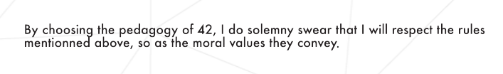

<image src="https://github.com/evgenkarlson/ALL_SCHOOL_42/raw/master/03_Norme____(%D0%9D%D0%BE%D1%80%D0%BC%D1%8B_%D0%B8_%D0%9F%D1%80%D0%B0%D0%B2%D0%B8%D0%BB%D0%B0_%D0%A8%D0%BA%D0%BE%D0%BB%D1%8B)/src/page1image3852832-small-13.png">

 

<h1>42 Commandments</h1>

<h2>42Staff <a href="pedago@42.fr">pedago@42.fr</a></h2>

 

<i>Резюме: Добро пожаловать на курс Школы 42! Здесь перечислены основные заповеди Школы 42.</i>

 
 
 

# Глава I. Предисловие

Вот что Википедия рассказывает о муравьях:

Муравьи являются эусоциальными насекомыми семейства Formicidae и, наряду с родственными осами и пчелами, принадлежат к отряду перепончатокрылых. Муравьи произошли от осоподобных предков в меловой период, около 99 миллионов лет назад, и разнообразились после появления цветковых растений. Классифицировано более 12 500 из 22 000 видов. Их легко идентифицировать по их локтевым антеннам и характерной узловой структуре, образующей их тонкую талию.
Муравьи образуют колонии, размер которых варьируется от нескольких десятков хищных особей, живущих в небольших естественных полостях, до высокоорганизованных колоний, которые могут занимать большие территории и состоять из миллионов особей. Более крупные колонии состоят из различных каст бесплодных бескрылых самок, большинство из которых - рабочие (эргаты), а также солдаты (закусочные).
и другие специализированные группы. Почти во всех колониях муравьев также есть несколько фертильных самцов, называемых «трутнями» (анер), и одна или несколько фертильных самок, называемых «королевы» (гины). Колонии описываются как суперорганизмы, потому что муравьи действуют как единое целое, коллективно работая вместе, чтобы поддержать колонию.

 
 
 

# Глава II. Введение

Чтобы позволить вам сделать шаг вперед и достичь целей построения, 42 просят вас следовать этим заповедям. Речь идет о прожиточном минимуме для хорошего прогресса в учебе. Если в один прекрасный день вы захотите больше объяснений об этих заповедях, почему мы сделали такой выбор, и, в более общем плане, о педагогике школы, используйте инструкцию, как и персонал, чтобы ответить на ваши вопросы. Но до тех пор следуйте этим 42 правилам. Обратите внимание, что некоторые из этих правил уже включены во внутренние правила школы, которые вы уже приняли на adm.42.fr.

 
 
 

# Глава III. Заповеди

1. Цифровые технологии - это ваша страсть.

2. Ваша цель в школе 42: расширить свои компетенции на цифровом рынке.

3. Что принесет вам школа 42: Она предоставит вам доступ к рынку труда, долгую и устойчивую карьеру в цифровом мире и повысит вашу коммуникабельность.

4. Какая для вас цель в школе 42: быть пионером цифровых технологий.

5. Вы несете ответственность за управление своим прогрессом: школа 42 предлагает вам индивидуальный курс, адаптированный к вашему собственному ритму.

6. Проблемы выделят ваш курс. Школа 42 не даст вам ни малейшего представления. Ваша роль - самостоятельно находить решения для достижения своих целей.

7. Будьте активны. Не ждите, что все будет сделано само по себе. 42 - это школа, ориентированная на 100% обучение на практике.

8. Будьте независимы в своем курсе. Не ждите, пока кто-нибудь скажет вам, что делать.

9. Сотрудничайте как над сольными проектами, так и над командными. Чтобы противостоять вызовам, обмены и дебаты станут вашим лучшим оружием.

10. Не верить. Быть уверенным. Технически, организационно, административно.

11. Для уверенности проверяйте, тестируйте.

12. Не бойтесь потерпеть неудачу. Неудача - это способ учиться.

13. Проверьте еще раз. Работайте с другими, чтобы больше проверять.

14. Дерзай. В худшем случае вы проиграете. Смотри 12-ю заповедь.

15. Будьте внимательны в своей работе.

16. Участвуйте на своем курсе: вы должны работать не менее 50 часов в неделю. Ваша работоспособность - это ценность. Школа открыта 24/7.

17. Один день - да, другой - нет, иногда ночью, другие при дневном свете ... хаос избегайте вашего прогресса.

18. Ожидайте появления большой и разнородной рабочей группы, чтобы легко находить новые идеи и проектные группы.

19. Для совместной и командной работы отдавайте предпочтение студентам, у которых еще нет решения проекта.

20. Будьте вовлечены в свою проектную команду и не позволяйте ей делать свою работу без вас.

21. Ваша проектная команда сплочена, его успех, как и его неудача, - это ответственность каждого, и конфликты необходимо разрешать внутри компании.

22. Работа в школе. Чтобы учиться друг у друга, сотрудничать, вы должны быть здесь физически вместе с другими. Удаленно это не сработает.

23. Участвуйте в оценке ваших проектов. Они сделают вам шаг назад.

24. Участвуйте в оценке других проектов. От этого зависит качество сообщества.

25. Справедливо и строго тестируйте свои проекты, как и другие, во время оценки собственными тестами.

26. Сохраняйте школьный дух. Выполняйте все заданные задания и проекты.

27. Не ищите системных нарушений. Вы исказите свое собственное построение и, таким образом, свою ценность на рынке.

28. Не обманывайте намеренно. Это аморально и противоречит 12-й заповеди.

29. Не отправляйте проект, который невозможно воспроизвести в одиночку. Даже если это не нужно, это обман.

30. Вы работаете не на родителей, даже не на персонал. Это для вас.

31. Оставайтесь вовлеченными в сообщество, в его развитие и качество в конце
ваше образование.

32. Помогите сохранить уважение к этим заповедям в обществе.

33. Будьте доброжелательны и сочувствуйте своим товарищам, как и всем, с кем вы общаетесь.

34. Не бойтесь профессионального мира.

35. Уважайте оборудование.

36. Уважайте помещения. Таким образом даются конкретные инструкции.

37. Уважайте людей, студентов, сотрудников, партнеров, посетителей.

38. Уважайте действующее законодательство вашей страны.

39. Соблюдайте действующие законы и правила по потреблению спирта.

40. Соблюдайте действующие законы и распоряжения в отношении табако, лекарств или аналогичных продуктов.

41. Не стесняйтесь общаться с персоналом, рассказывать о своих проблемах даже в курсе, вносить свой вклад в курс.

42. Если вы заблуждаетесь или не понимаете наших педагогических решений, спросите нас. Обычно мы не делаем ничего случайного.

 
 
 

# Глава III. Обязательная часть

Вы должны переписать ПИСЬМЕННО следующее предложение, за которым следует разрыв строки с именем `turn_in`.

 

    By choosing the pedagogy of 42, I do solemny swear that I will respect the rules mentionned above, so as the moral values the convey.
