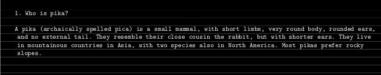

<image src="https://github.com/evgenkarlson/ALL_SCHOOL_42/raw/master/03_Norme____(%D0%9D%D0%BE%D1%80%D0%BC%D1%8B_%D0%B8_%D0%9F%D1%80%D0%B0%D0%B2%D0%B8%D0%BB%D0%B0_%D0%A8%D0%BA%D0%BE%D0%BB%D1%8B)/src/page1image3852832-small-13.png">

 

<h1>ft_debut</h1>

<h2>42Staff <a href="https://staff@42.us.org">staff@42.us.org</a></h2>

 

<i>Резюме: Цель этого проекта - убедиться, что вы понимаете культуру и основные ценности Школы 42.</i>

 
 
 

# Глава I. Предисловие

Вот отрывок из сценария фильма «Стражи Галактики»:

...
КИЛНСКАЯ ТЮРЬМА ВЫСОКОЙ БЕЗОПАСНОСТИ

РАКЕТА (Брэдли Купер):

Я думаю, что большая часть Корпуса Новы хочет соблюдать законы, но эти здесь, они коррумпированы и жестоки. Но, эй, это не моя проблема. Я не буду здесь долго. Я сбежал из 22 тюрем. Этот ничем не отличается. Тебе повезло, что баба появилась, потому что в противном случае я и Грут забирали бы эту награду прямо сейчас, а тебя бы разобрали. И расквартирован Йонду и этими Опустошителями.b

ПИТЕР КИЛЛ (Крис Пратт):

За эти годы многие люди пытались меня убить. Я не собираюсь быть сбитым деревом и говорящим енотом.

РАКЕТА (Брэдли Купер):

Держать. Что за енот.

ПИТЕР КИЛЛ (Крис Пратт):

"Что такое енот?" Ты такой, глупый.

РАКЕТА (Брэдли Купер):

Нет ничего похожего на меня, кроме меня.

ПИТЕР КИЛЛ (Крис Пратт):

Итак, у этой Сферы есть настоящий блестящий синий чемодан, Ковчег Завета, что-то вроде Мальтийского Сокола. Что это?

GROOT (Вин Дизель):

Я есть Грут.

ПИТЕР КИЛЛ (Крис Пратт):

Ну и что? Что такое сфера?

ГАМОРА (Зои Салдана):

У меня нет слов для бесчестного вора.

РАКЕТА (Брэдли Купер):

Довольно высокий и могущественный, исходящий от лакея маньяка-геноцида. Да, я знаю, кто ты. Любой, кто знает тебя.

ПИТЕР КИЛЛ (Крис Пратт):

Да, мы знаем, кто ты. Кто она?

GROOT (Вин Дизель):

Я есть Грут.

ПИТЕР КИЛЛ (Крис Пратт):

Да, ты это сказал.

ГАМОРА (Зои Салдана):

Я не собирал Сферу для Ронана. Я предал его. У меня было соглашение продать его третьему лицу.

GROOT (Вин Дизель)
Я есть Грут.

ПИТЕР КИЛЛ (Крис Пратт):

Что ж, это так же увлекательно, как и первые 89 раз, когда вы мне это сказали. Что не так с Деревом?

РАКЕТА (Брэдли Купер):

Ну, он не умеет хорошо говорить, как мы с вами. Таким образом, его словарный запас ограничен «я», «я» и «грут». Исключительно в таком порядке.

ПИТЕР КИЛЛ (Крис Пратт):

Вот что я тебе скажу, это будет очень тонко, очень быстро. (Питер увидел охранника, который возился со своим плеером) Привет. Убери это. Привет! Послушай меня, большой синий ублюдок. Снимите эти наушники. Это мое. Те принадлежат конфискации. Эта кассета и этот плеер мои! (Питер убит электрическим током тюремным надзирателем) Зацепился за чувство, Blue Swede, 1973 год. Эта песня принадлежит мне!!
...

 
 
 

# Глава II. Введение

Поздравляем с завершением Piscine! Было тяжело, да? Теперь вы часть большой семьи Школы 42, если не считать всех забот, и мы рады, что вы присоединились к нам.

Как и в любом сообществе, лучший совет по ассимиляции - «В Риме, делай, как римляне». Мы приветствуем вас с открытым сердцем и не ожидаем ничего, кроме того, что станете одним из нас и соблюдаем простые правила.

Каковы правила? В этом проекте вы собираетесь их называть сами.
...
...

 
 
 

# Глава III. Цели

Во время учебы в Школе 42 крайне важно понимать основные ценности и культуру Школы 42. Но также очень важно понимать себя и причины, по которым вы здесь. Почему вы пришли в Школу 42? Чего вы надеетесь достичь? Хорошее время подумать об этом.

В этом проекте пока не будет никакого кодирования, но он заставит ваш разум погрузиться в педагогику школы 42. Вы провели 4 недели в школе 42, барахтаясь в `Piscine C`, так что вам не составит труда просто обобщить то, что вы уже знаете.
...

 
 
 

# Глава IV. Основные инструкции

Вам нужно будет отправить один файл со всеми своими ответами в следующем формате:

- номер вопроса

- текст вопроса (скопировать и вставить)

- ваш ответ

 

>1. Кто такой пика?
>
>Пика (архаично пишется pica) - это небольшое млекопитающее с короткими конечностями, очень круглым телом, закругленными ушами и без внешнего хвоста. Они напоминают своего близкого родственника кролика, но с более короткими ушами. Они живут в горных странах Азии, а также в Северной Америке два вида. Большинство пищух предпочитают каменистые склоны.

...

 
 
 

# Глава V. Обязательная часть

Ответить на вопросы, приведенные ниже.  
Будьте честны, будьте кратки, думайте.

## V.1 Что такое Школа 42

1. Как можно более кратко ответьте на вопрос, что такое Школа 42? Как бы вы описали Школу 42 человеку, который не знает, что такое Школа 42?

2. Почему нет инструкций по начальным логическим тестам Школы 42?

3. Каковы 42 основных принципа Школы?

## V.2 Почему именно Школа 42

4. Если кто-то думает о переходе на обучение в Школе 42, но у него нет опыта программирования - вы действительно думаете, что это того стоит?

5. Что делает Школу 42 уникальным?

## V.3 Как добиться успеха в Школе 42

6. Как вы думаете, чему вы больше всего учитесь в Школе 42?

7. Представьте (это произойдет очень скоро в реальной жизни!), Вы на какое-то время застряли в проблеме и не знаете, что делать - каковы будут ваши следующие шаги?

8. Как вы обеспечите, чтобы ваш личный уровень мотивации оставался высоким на ежедневной основе для прохождения хотя бы 1 уровня в месяц без давления как в `Piscine C` и жестких сроках?

## V.4 Жизнь после Школы 42

9. Если кто-то спросит вас, почему на веб-сайте Школы 42 говорится, что стажировки необходимы, но они не предлагают трудоустройство, что вы ответите?

10. Как проходят стажировки? Является ли обязательным, чтобы вы достигли определенного уровня перед отъездом на стажировку, или вы можете подтвердить его в любое время, когда найдете его?

11. Как Школа 42 помогает вам адаптироваться на рабочем месте?
...

 
 
 

# Глава VI Бонус

Мы все любим знакомиться с новыми людьми и получать бонусные баллы, не так ли? :)

Вот вам вызов:

Найдите 5 курсантов с уровнем не ниже 5 и спросите, над каким проектом они работают в настоящее время, 

или

спросите 3 человек Среди ваших `Бокалов` , какова их текущая задача,

или

.... поговорите с GAETAN о его любимых пиццериях!

Конечно, не забудьте добавить эту полезную информацию в свой файл `.txt` в разделе «Бонусы».

Удачи тебе!
