# NETWHAT - ответы #


### Содержание <a name="Contents"></a>
* [Что такое IP-адрес ?](#IPaddress) 
* [Что такое маска сети  ?](#Netmask)
* [Что такое подсеть IP с маской сети ?](#IPwithNetmask)
* [Что такое широковещательный адрес подсети ?](#broadcast)
* [В чем разница между публичным и частным IP-адресами ?](#pubandprivIP)
* [Что такое класс IP-адресов ?](#classIP)
* [Что такое TCP ?](#TCP)
* [Что такое UDP ?](#UDP)
* [Что такое сетевые уровни ?](#networklayers)
* [Что такое модель OSI ?](#OSI)
* [Что такое DHCP-сервер и протокол DHCP ?](#DHCP)
* [Что такое DNS-сервер и DNS-протокол ?](#DNS)
* [Как работает маршрутизация с IP ?](#IProut)
* [Какой шлюз по умолчанию используется для маршрутизации ?](#gateway)
* [Что такое порт с точки зрения IP и для чего он используется при подключении к другому устройству ?](#device)
* [Таблица различий между TCP и UDP](#table)


</br>
</br>

---------------------------------------------------------------------------------------------
# Что такое IP-адрес ? <a name="IPaddress"></a>


Адрес интернет-протокола (`IP-адрес`) - это числовая метка, присваиваемая каждому устройству, подключенному к компьютерной сети, использующей Интернет-протокол для связи. 

`IP-адрес` выполняет две основные функции: 
* идентификацию `хоста` или `сетевого интерфейса`
* адресацию местоположения.

Интернет-протокол версии 4 (`IPv4`) определяет IP-адрес как 32-разрядный номер однако из-за роста Интернета и истощения доступных `IPv4-адресов` в 1998 году была стандартизирована новая версия IP (`IPv6`), использующая 128 бит для `IP-адреса`. 

Развертывание `IPv6` продолжается с середины 2000-х годов.

IP-адреса записываются и отображаются в удобочитаемых нотациях, таких как `172.16.254.1` в `IPv4` и `2001: db8:0:1235:0:567:8:1` в `IPv6`. Размер префикса маршрутизации адреса обозначается в нотации `CIDR` путем суффикса адреса с числом значимых битов, например, `192.168.1.15 / 24`, что эквивалентно исторически используемой маске подсети `255.255.255.0`.

Управление пространством IP-адресов в глобальном масштабе осуществляется Управлением назначенных номеров Интернета (`IANA`) и пятью региональными интернет-реестрами (`RIR`), ответственными на своих назначенных территориях за назначение местным интернет-реестрам, таким как интернет-провайдеры и другие конечные пользователи. `IPv4-адреса` были распределены `IANA` по `RIR` блоками примерно по `16,8 миллиона адресов` каждый, но с 2011 года они были исчерпаны на уровне `IANA`. Только один из `RIR` все еще имеет запас для выполнения местных заданий в Африке.  Некоторые `IPv4-адреса` зарезервированы для частных сетей и не являются глобально уникальными.

Сетевые администраторы назначают `IP-адрес` каждому устройству, подключенному к сети. Такие назначения могут быть статическими (фиксированными или постоянными) или динамическими, в зависимости от методов работы сети и особенностей программного обеспечения. 

[[открыть сайт источник]](https://en.wikipedia.org/wiki/IP_address) 

[[ВЕРНУТЬСЯ К СОДЕРЖАНИЮ]](#Contents) 


</br>
</br>

------------------------------------------------------------------------------------------
# Что такое Маска сети ? <a name="Netmask">


Маска сети - это 32-разрядная двоичная маска, используемая для разделения `IP-адреса` на подсети и указания доступных узлов сети.

В маске сети два из возможных адресов, представленных в виде конечного байта, всегда предварительно назначены и недоступны для пользовательского назначения. Например, в `255.255.225.0` ноль `0` - это назначенный сетевой адрес. В `255.255.255.255` конечным `255` является назначенный широковещательный адрес. Эти два значения не могут быть использованы для назначения `IP-адреса`.

Ниже приведен пример сетевой маски и пример ее двоичного преобразования.


| Маска сети: | 255. | 255. | 255. | 255 |
|:-------:|:----------------:|:---------------:|:------------:|:---------:|
| Двоичный код: | 11111111 | 11111111 | 11111111 | 11111111 |
| Длина маски сети | 8 | 16 | 24 | 32 | 


Отсчет битов в двоичном преобразовании позволяет определить длину маски сети. Выше приведен пример `32-разрядного` адреса. Однако этот адрес является `широковещательным` адресом и не позволяет подключать к нему никакие `хосты` (компьютеры или другие сетевые устройства).

Обычно используемая сетевая маска - это `24-битная` сетевая маска, как показано ниже.


| Маска сети: | 255. | 255. | 255. | 0 |
|:-------:|:----------------:|:---------------:|:------------:|:---------:|
| Двоичный код: | 11111111 | 11111111 | 11111111 | 00000000 |
| Длина маски сети | 8 | 16 | 24 | -- | 


Используя `24-битную` сетевую маску, сеть могла бы иметь `2 097 150 сетей` или `254 различных хоста` с диапазоном `IP` адресов `192.0.1.x - 223.255.254.x`, что обычно более чем достаточно адресов для одной сети.

Простая формула может быть использована для определения допустимого количества сетей, которые может поддерживать маска сети.

```
(2^(длина маски сети - количество использованных сегментов)) - 2
```

Например, если мы использовали длину маски сети 24, имея маску сети `255.255.255.0` с тремя слитыми сегментами, вычитаем три из длины маски сети, например, `24-3 = 21`. Определив это число, подключите его к приведенной выше формуле, чтобы получить `2^21-2 = 2 097 150` общее число сетей. Вы вычитаете два из этого числа из-за `широковещательных` и `сетевых адресов`, которые уже используются.

Другой пример - это сетевая маска длиной 16, имеющая сетевую маску `255.255.0.0` с двумя используемыми сегментами. Используя приведенную выше формулу, вы получите `2^14-2 = 16 382` общее количество сетей.

Чтобы определить количество хостов, которые может поддерживать маска сети, используйте следующую формулу.

```
(2^(количество нулей)) - 2
``` 

Например, при длине маски сети в 24 бита, как показано на приведенной выше диаграмме, существует восемь нулей (восемь свободных битов в конце адреса). Поэтому, используя приведенную выше формулу, это будет `2^8-2 = 254` общее число хостов. Опять же, два вычитается из этого числа, чтобы учесть широковещательный и сетевой адреса.

Опять же, еще один пример длины сетевой маски 16, там будет 16 нулей. Формула в этом случае будет равна `2^16-2 = 65.534` общего числа хостов.

Ниже приводится разбивка каждого из широко используемых сетевых классов.


| Class | длина маски сети | количество сетей | количество хостов | маска сети |
|:-------:|:----------------:|:---------------:|:------------:|:---------:|
| Class A | 8 | 126 | 16.777.214 | 255.0.0.0 |
| Class B | 16 | 16.382 | 65.534 | 255.255.0.0 |
| Class C | 24 | 2.097.150 | 254 | 255.255.255.0 |


[[открыть сайт источник]](https://www.computerhope.com/jargon/n/netmask.htm) 

[[ВЕРНУТЬСЯ К СОДЕРЖАНИЮ]](#Contents) 


</br>
</br>

------------------------------------------------------------------------------------------
# Что такое IP подсеть с маской сети ? <a name="IPwithNetmask">


IP-адрес состоит из двух компонентов: сетевого адреса и адреса хоста. Маска подсети разделяет IP-адрес на `сетевой адрес` и `хост-адреса` (`<сеть><хост>`). Подсети дополнительно делят `хост-часть` IP-адреса на `подсеть` и `адрес хоста` (`<сеть><подсеть><хост>`), если требуется дополнительная подсеть. Используйте калькулятор подсети для получения информации о подсети из IP-адреса и маски подсети. Он называется маской подсети, поскольку используется для идентификации сетевого адреса IP-адреса путем выполнения побитовой операции и на маске сети.

Маска подсети - это 32-разрядное число, которое маскирует IP-адрес и делит его на сетевой адрес и адрес хоста. Маска подсети создается путем установки битов сети на все `1` и установки битов хоста на все `0`. в данной сети два адреса хоста зарезервированы для специальных целей и не могут быть назначены хостам. Адрес `0` присваивается сетевому адресу, а `255`  - `широковещательному адресу`, и они не могут быть назначены хостам.

Примерами широко используемых сетевых масок для классифицированных сетей являются `8-битные` (класс `A`), `16-битные` (класс `В`) и `24-битные` (класс `С`) маски сетей, а бесклассовые сети представлены следующим образом:


| Class	| Адресс | количество хостов | маска сети (Двоичный) | маска сети (Десятичный) |
|:-------:|:----------------:|:---------------:|:------------:|:---------:|
| CIDR | /4 | 240.435.456 | 11110000 00000000 00000000 00000000	| 240.0.0.0 |
| CIDR | /5 | 134.217.728 | 11111000 00000000 00000000 00000000 | 248.0.0.0 |
| CIDR | /6 | 67.108.864 | 11111100 00000000 00000000 00000000 | 252.0.0.0 |
| CIDR | /7 | 33.554.432 | 11111110 00000000 00000000 00000000 | 254.0.0.0 |
| A | /8 | 16.777.216 | 11111111 00000000 00000000 00000000 | 255.0.0.0 |
| CIDR | /9 | 8.388.608 | 11111111 10000000 00000000 00000000 | 255.128.0.0 |
| CIDR | /10 | 4.194.304 | 11111111 11000000 00000000 00000000 | 255.192.0.0 |
| CIDR | /11 | 2.097.152 | 11111111 11100000 00000000 00000000 | 255.224.0.0 |
| CIDR | /12 | 1.048.576 | 11111111 11110000 00000000 00000000 | 255.240.0.0 |
| CIDR | /13 | 524.288 | 11111111 11111000 00000000 00000000	 | 255.248.0.0 |
| CIDR | /14 | 262.144 | 11111111 11111100 00000000 00000000 | 255.252.0.0 |
| CIDR | /15 | 131.072 | 11111111 11111110 00000000 00000000 | 255.254.0.0 |
| B | /16 | 65.534 | 11111111 11111111 00000000 00000000 | 255.255.0.0 |
| CIDR | /17 | 32.768 | 11111111 11111111 10000000 00000000 | 255.255.128.0 |
| CIDR | /18 | 16.384 | 11111111 11111111 11000000 00000000 | 255.255.192.0 |
| CIDR | /19 | 8.192 | 11111111 11111111 11100000 00000000 | 255.255.224.0 |
| CIDR | /20 | 4.096 | 11111111 11111111 11110000 00000000 | 255.255.240.0 |
| CIDR | /21 | 2.048 | 11111111 11111111 11111000 00000000 | 255.255.248.0 |
| CIDR | /22 | 1.024 | 11111111 11111111 11111100 00000000 | 255.255.252.0 |
| CIDR | /23 | 512 | 11111111 11111111 11111110 00000000 | 255.255.254.0 |
| C | /24 | 256 | 11111111 11111111 11111111 00000000 | 255.255.255.0 |
| CIDR | /25 | 128 | 11111111 11111111 11111111 10000000 | 255.255.255.128 |
| CIDR | /26 | 64 | 11111111 11111111 11111111 11000000 | 255.255.255.192 |
| CIDR | /27 | 32 | 11111111 11111111 11111111 11100000 | 255.255.255.224 |
| CIDR | /28 | 16 | 11111111 11111111 11111111 11110000 | 255.255.255.240 |
| CIDR | /29 | 8 | 11111111 11111111 11111111 11111000 | 255.255.255.248 |
| CIDR | /30 | 4 | 11111111 11111111 11111111 11111100 | 255.255.255.252 |


Подсеть IP-сети заключается в разделении большой сети на несколько небольших сетей для целей реорганизации и обеспечения безопасности. Все узлы (хосты) в подсети видят все пакеты, передаваемые любым узлом в сети. Производительность сети отрицательно влияет на большую нагрузку трафика из-за столкновений и повторных передач.

Применение маски подсети к IP-адресу отделяет сетевой адрес от адреса хоста. Сетевые биты представлены `1` в маске, а биты хоста представлены `0`. выполнение побитовой логической операции и над IP-адресом с маской подсети создает сетевой адрес. Например, применение маски подсети `класса C` к нашему IP-адресу `216.3.128.12` приводит к следующему сетевому адресу подсетей сети: 


```
IP:   1101 1000 . 0000 0011 . 1000 0000 . 0000 1100  (216.003.128.012)

Mask: 1111 1111 . 1111 1111 . 1111 1111 . 0000 0000  (255.255.255.000)

      ---------------------------------------------

      1101 1000 . 0000 0011 . 1000 0000 . 0000 0000  (216.003.128.000)
``` 


Вот еще один сценарий, в котором требуется подсеть. Представьте себе, что веб-хост с сетью `класса С` должен разделить сеть так, чтобы части сети можно было сдавать в аренду своим клиентам. Предположим, что хост имеет сетевой адрес `216.3.128.0` (как показано в приведенном выше примере). Допустим, мы разделим сеть на 2 части и посвятим первую половину себе, а вторую-своим клиентам.


```
 216 .   3 . 128 . (0000 0000)  (1-я половина закреплена за веб-хостингом)

   216 .   3 . 128 . (1000 0000)  (2-я половина закреплена за покупателями)
```


Веб-узел будет иметь маску подсети `216.3.128.128 (/25)`. Теперь мы далее разделим 2-ю половину на восемь блоков по 16 IP-адресов. 

```
   216 .   3 . 128 . (1000 0000)  Покупатель 1 -- Получает 16 IP-адресов (14 доступных)

   216 .   3 . 128 . (1001 0000)  Покупатель 2 -- Получает 16 IP-адресов (14 доступных)

   216 .   3 . 128 . (1010 0000)  Покупатель 3 -- Получает 16 IP-адресов (14 доступных)

   216 .   3 . 128 . (1011 0000)  Покупатель 4 -- Получает 16 IP-адресов (14 доступных)

   216 .   3 . 128 . (1100 0000)  Покупатель 5 -- Получает 16 IP-адресов (14 доступных)

   216 .   3 . 128 . (1101 0000)  Покупатель 6 -- Получает 16 IP-адресов (14 доступных)

   216 .   3 . 128 . (1110 0000)  Покупатель 7 -- Получает 16 IP-адресов (14 доступных)

   216 .   3 . 128 . (1111 0000)  Покупатель 8 -- Получает 16 IP-адресов (14 доступных)

   -----------------------------

   255 . 255 . 255 . (1111 0000)  (Маска подсети 255.255.255.240)
``` 

`CIDR` - бесклассовая Междоменная маршрутизация
Бесклассовая Междоменная маршрутизация (`CIDR`) была изобретена для того, чтобы Интернет не исчерпывал свои IP-адреса. `32-разрядные` адреса `IPv4` имеют ограничение в 4 294 967 296 (232) уникальных IP-адресов. Классовая схема адресов (классы `A`, `B` и `C`) распределения IP-адресов с `8-битным` шагом может быть очень расточительной. При использовании схемы классовой адресации минимальное количество IP-адресов, выделенных организации, составляет 256 (`класс C`). Предоставление 256 IP-адресов организации, требующей только 15 IP-адресов, является расточительным. Кроме того, организации, требующей более 256 IP-адресов (скажем, 1000 IP-адресов), присваивается `класс B`, который выделяет 65 536 IP-адресов. Аналогичным образом, организации, требующей более 65 636 (65 634 пригодных для использования IP-адресов), присваивается сеть `класса А`, которая выделяет 16 777 216 (16,7 миллиона) IP-адресов. Этот тип распределения адресов очень расточителен.

С помощью `CIDR` сеть IP-адресов выделяется с шагом в `1 бит` в отличие от `8 бит` в классовой сети. Использование записанного адреса `CIDR` может легко представлять классовые адреса (`класс A` = `/ 8`, `класс B` = `/ 16` и `Класс C` = `/ 24`). Число рядом с косой чертой (т. е. `/8`) представляет собой количество битов, назначенных сетевому адресу. Приведенный выше пример можно проиллюстрировать с помощью CIDR следующим образом: 

```
   216.3.128.12, с маской подсети 255.255.255.128 

   записывается как 216.3.128.12/25


   Аналогичным образом, 8 клиентов с блоком из 16 IP-адресов 

   можно записать как:

   216.3.128.129/28, 216.3.128.130/28, и так далее.
```  

С внедрением схемы адресации `CIDR` IP-адреса более эффективно распределяются между провайдерами и клиентами; и, следовательно, существует меньший риск того, что IP-адреса закончатся в ближайшее время. Для получения подробной спецификации по `CIDR`, пожалуйста, ознакомьтесь с `RFC 1519`. С введением дополнительных игровых, медицинских, прикладных и телекоммуникационных устройств, требующих статических IP-адресов в дополнение к более чем 6,5 миллиардам (июль 2006 года est.) население мира, `IPv4-адреса` с схемой адресации `CIDR` в конечном итоге закончатся. Для решения проблемы нехватки `IPv4-адресов` в 1993 году была введена схема адресов `IPv6` (128-битная). 

[[открыть сайт источник]](https://www.iplocation.net/subnet-mask) 

[[ВЕРНУТЬСЯ К СОДЕРЖАНИЮ]](#Contents) 


</br>
</br>

------------------------------------------------------------------------------------------
# Что такое широковещательный адрес подсети? <a name="broadcast"></a>


Основное значение термина `broadcast` (вещание) - это передача звука или видео по радиосети; 

Вторичное значение описывает форму связи, которая передается в компьютерной сети в виде сообщения без конкретных получателей. 

Вещание(`broadcast`) в компьютерной сети - это передача сообщения, которое не требует ответа для всех пользователей Сети. Один компьютер в сети отправляет пакет данных всем другим пользователям одновременно. Отправителю не нужно указывать адреса получателей-именно так широковещательный процесс отличается от одноадресного, где адресуется только один известный получатель. Общее преимущество вещания заключается в том, что информация может распространяться без необходимости многократной передачи.

Для проведения процедуры требуется специальный адрес, который заменяет указанные адреса получателей. Этот широковещательный IP-адрес особенно полезен, если адреса отдельных пользователей Сети неизвестны.
  
> ###  Определение
>
> Вещание - это многоточечное соединение в компьютерной сети. 
> Таким образом, пакет данных передается из одной точки всем пользователям сети обмена сообщениями. 
> Это происходит с использованием широковещательного адреса.
  
Отправитель инициирует широковещательное соединение и предоставляет адрес, по которому получатели могут связаться с ними. Вещание работает аналогично списку рассылки: получатели не видны друг другу, а отправитель не имеет возможности узнать адреса пользователей Сети. Только в том случае, если пользователи связываются с отправителем один на один, они раскрывают свой собственный адрес. 

> ### Заметка
>
> Помимо широковещательных и одноадресных процедур, существуют также другие формы сетевого взаимодействия, такие как многоадресная  процедура, в которой адресуются выбранные пользователи (группы), и геокастинговая процедура, в которой этот выбор географически ограничен.
 


### Principles of broadcast technology

> Принципы вещательной технологии

Адресация используется для передачи данных для связи в сети по интернет-протоколу, сокращенно "IP", от одной системы к другой. IP-адрес обеспечивает четкую переадресацию и отправку пакетов данных от источника к месту назначения. Как и в случае с телефонным номером, этот адрес можно разделить на код города и номер телефона, но для IP – адресов он известен как сетевая часть и хост-часть. Это разделение происходит с помощью маски подсети, которая помещается поверх IP-адреса как шаблон. Маска подсети имеет ту же длину, что и IPv4-адрес. Он описывает, какие битовые позиции работают внутри IP-адреса как сетевая часть или хост-часть.

Данные и информация передаются на все устройства в сети по широковещательному адресу. Сетевые компоненты отвечают за прием и обработку данных. Роль широковещательного IP-адреса заключается в соединении всех устройств друг с другом в сети.

IP-адрес: адрес интернет-протокола (IP-адрес) - это числовое описание. Каждому устройству, подключенному к компьютерной сети на основе интернет-технологии, присваивается IP-адрес. Этот IP-адрес использует интернет-протокол для связи. IP-адрес выполняет две основные задачи: идентификацию хоста или сетевого интерфейса и адресацию местоположения.

Ethernet: программное и аппаратное обеспечение соединены друг с другом с помощью технологии `Ethernet` для кабельных сетей передачи данных. С помощью этой технологии возможен обмен данными между локально подключенными пользователями. Беспроводные сети, в частности сети компаний и домашние сети, чаще всего используют `Ethernet`. Кроме того, сеть `Ethernet` часто составляет основу интранета.

MAC-адрес (media access control - контроль доступа к медиа): MAC-адрес - это адрес устройства для сетевого устройства. Он обычно записывается как шестнадцатеричное число, например, `08-00-20-ae-fd-7e` или `08: 00: 20: ae:fd: 7e` (или: `080020aefd7e`). 

### How does broadcasting work?

> Как работает вещание ?

Широковещательный пакет отправляется сразу всем пользователям локальной сети. Они не должны быть явно названы получателями. Пользователи сети могут открывать пакеты данных, а затем интерпретировать информацию, выполнять инструкции или отбрасывать ее. 

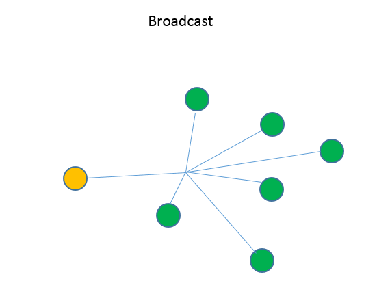 

Связь через широковещательную передачу соответствует схеме маршрутизации. 
Сетевой пользователь отправляет пакет данных, который получают все пользователи этой сети.
Существует различие между ограниченным вещанием и направленным вещанием: 

#### Ограниченное вещание 

При ограниченной широковещательной передаче в качестве места назначения указывается IP-адрес. Этот IP-адрес всегда `255.255.255.255`. Технически эта трансляция должна быть отправлена на все существующие IP-адреса. Однако на самом деле он служит адресом для трансляции в сети. Это назначение всегда находится в своей собственной сети и поэтому может быть реализовано в широковещательной передаче `Ethernet`. Маршрутизатор не пересылает такой пакет.

#### Прямое вещание

При направленной широковещательной передаче все получатели всегда адресуются в пределах целевой сети. Комбинация номера целевой сети и установки всех битов хоста на `1` создает широковещательный адрес в этом случае. Если адресат не находится в своей собственной (подсети) сети, маршрутизатор пересылает пакет данных.

**Биты хоста** - это часть IP-адреса, идентифицирующая конкретный хост в подсети. Маска подсети определяет, какая доля адреса используется для сетевых битов и для битов хоста. Например, IPv4-адрес `192.168.0.64 / 26` имеет 6-разрядную хост-часть, поскольку `26` из `32` бит зарезервированы для сетевой части. 

Каждая сеть или подсеть имеет выделенный широковещательный адрес, через который все пользователи сети могут осуществлять широковещательную передачу.

В широковещательном адресе все биты хоста имеют двоичное значение 1, поэтому, если все биты хоста имеют значение 0, это адрес подсети.

Пример: IPv4-адрес `192.128.64.7 / 24`

`192.128.64.7` - это IP-адрес, а `24` - маска подсети. Параметр `/24` соответствует маске подсети `255.255.255.0.` IP-адрес состоит из 4 десятичных знаков, называемых октетами, которые разделены точками. Один октет содержит 8 бит, поэтому `IPv4` - это `32-разрядный` адрес. Каждый `октет` может представлять собой число от 0 до 255. В этом случае весь последний октет состоит из битов хоста. Поэтому в данном примере широковещательный адрес будет равен `192.128.64.255` – так что все биты хоста равны 1. 

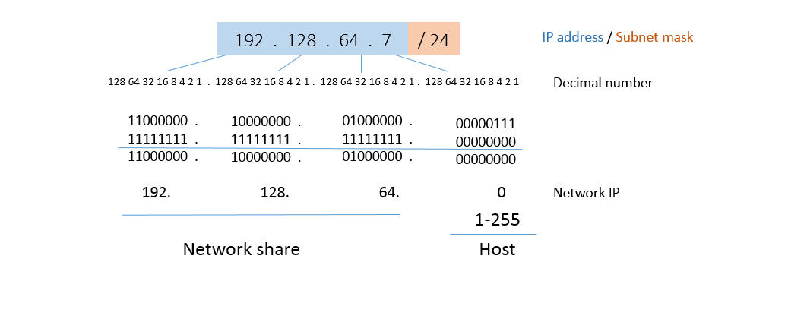 

В качестве примера можно привести IPv4-адрес `192.128.64.7/24`.

В Примере IPv4-адреса `192.128.64.7 / 24` можно прочитать хост-часть, а также сетевую часть адреса. Таким образом, вы также узнаете широковещательный адрес.
Это можно прочитать из этой диаграммы:

`192.128.64.1` = первый адрес хоста

`192.128.64.254` = Последний адрес хоста

`192.128.64.255` = широковещательный адрес

Где вы можете найти широковещательный адрес? IP-адрес представляет собой 4-значный ряд чисел со значениями от 0 до 255. Широковещательный IP-адрес назначается только один раз в каждой сети. Это всегда последний IP-адрес подсети. 

> ### Заметка 
>
> Сетевой адрес и широковещательный адрес не используются в качестве IP-адресов компьютеров. 
> В Сети первое поле адреса зарезервировано для сети, а последнее-для широковещательного адреса. 
> В поле между этими двумя адресами находятся адреса хостов сети.


Чтобы в `Windows` определить широковещательный адрес вашей сети, введите `cmd`  в `меню Пуск` и нажмите клавишу `enter`. 

При этом откроется консоль `Windows`. 

 

Откройте `консоль Windows`, чтобы определить другие IP-адреса в вашей сети. Для этого введите `cmd` в `меню Пуск` панели `Windows`.

Теперь введите `ipconfig /all `, чтобы узнать все детали вашей локальной сети. Эта команда позволяет вам получить свой собственный IP-адрес в интрасети, то есть в вашей домашней сети, а также маску подсети сети, помимо большого количества другой интересной информации. Вы можете получить широковещательный IP-адрес из этих деталей. В общедоступном Интернете маршрутизатор работает с другим IP-адресом, выделенным провайдером, который вы можете прочитать в интерфейсе маршрутизатора, например, или получить с помощью таких инструментов, как ifconfig.me

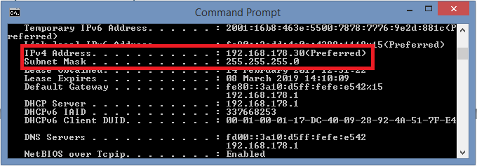 

С помощью `ipconfig` вы можете отобразить свой личный IP-адрес и маску подсети для вычисления широковещательного адреса.
В нашем примере с IP-адресом `192.168.64.172` и маской подсети `255.255.252.0` мы получаем сетевой адрес через подсеть: `192.168.64.0`. Сетевая Маска (в обозначении `CIDR` `/22`) включает 1022 хоста: 210 (поскольку у нас есть десять нулевых позиций в масках подсети, которые могут быть либо 0, либо 1), исключая сам сетевой адрес и широковещательный адрес. Таким образом, это последняя возможная позиция: `192.168.67.255` – последние десять позиций IP-адреса стоят на 1. 

[[открыть сайт источник]](https://www.ionos.com/digitalguide/server/know-how/broadcast-address/) 

[[ВЕРНУТЬСЯ К СОДЕРЖАНИЮ]](#Contents) 


</br>
</br>

------------------------------------------------------------------------------------------
# В чем разница между публичным и частным IP-адресами? <a name="pubandprivIP"></a>


Как следует из названий, основное различие между публичным IP и частным IP заключается в сетях, в которых они используются. Прежде чем углубляться в эти детали, IP-адрес или адрес интернет-протокола - это уникальный идентификатор, присвоенный каждому устройству в сети. Это позволяет однозначно идентифицировать каждое отдельное устройство в сети. Существует две категории IP-адресов, известных как публичные IP-адреса и частные IP-адреса. Публичные IP-адреса, которые являются уникальными во всем интернете, позволяют подключать устройства к интернету. Чтобы управлять уникальностью, их назначение управляется централизованно через организацию. Частные IP-адреса используются в частных сетях, которые не подключены к интернету или подключены к интернету через NAT. Здесь достаточно уникальности внутри частной сети, и, следовательно, один и тот же диапазон адресов будет использоваться в разных частных сетях, которые изолированы друг от друга. Когда IP-версия 4 считается `10.0.0.0-10.255.255.255`, `172.16.0.0-172.31.255.255` и от `192.168.0.0 до 192.168.255.255` зарезервированы для частных адресов, а остальные-для публичных IP-адресов.


**Что такое публичный IP?**

Публичный IP-адрес является глобально уникальным для Интернета. Согласно стандарту, определенные диапазоны IP-адресов были зарезервированы для использования частными сетями. Любой `IP`, который не зарезервирован для частного `IP`, может быть использован в качестве публичного `IP`. IP-сеть должна иметь уникальный IP-адрес для каждого своего устройства. Поскольку интернет также является IP-сетью, IP-адреса должны поддерживаться должным образом, чтобы предотвратить использование одного и того же IP-адреса несколькими устройствами. Это управление IP-адресами осуществляется организацией под названием `Internet Assigned Numbers Authority` (`IANA`), где они назначают диапазоны IP-адресов различным организациям. Когда эти IP-адреса назначены, интернет-маршрутизаторы должны быть настроены таким образом, чтобы устройства в интернете могли получить доступ к этому IP-адресу. То есть любой назначенный публичный IP-адрес является глобально маршрутизируемым. Диапазоны публичных адресов существуют как для интернет-протокола версии 4, так и для протокола версии 6 (`IPv4` и `IPv6`). IP-версия 4 предоставляет огромное количество IP-адресов, но количество устройств с назначенным публичным адресом стало настолько большим, что теперь схема адресов `IPv4` оказывается неадекватной. Таким образом, IPv6, который может предоставить больше IP-адресов по сравнению с `IPv4`, был введен и в настоящее время используется.

 


**Что такое частный IP?**

В организации могут быть устройства, которые должны подключаться к другим устройствам в организации, но не обязательно подключаться к интернету. Таким образом, в таких случаях достаточно назначить уникальный IP-адрес внутри внутренней сети, но нет необходимости назначать публичный IP-адрес. Здесь, поскольку сеть изолирована, теоретически можно использовать любой диапазон IP-адресов с единственным требованием, чтобы IP-адреса в частной сети были уникальными. Но, если по какой-либо случайности, если такая сеть подключена к интернету без изменения IP-адресов, это приведет к появлению дубликатов IP-адресов. Поэтому стандарты зарезервировали специальные диапазоны IP-адресов, которые будут использоваться для частных адресов. В `IPv4` три диапазона адресов были зарезервированы для частных IP-адресов. Они являются,

• От `10.0.0.0` до `10.255.255.255`

• С `172.16.0.0` по `172.31.255.255`

• С `192.168.0.0` по `192.168.255.255`

Скажем, компания а использует IP-адреса от `192.168.1.0` до `192.168.1.255` для своей частной сети. Кроме того, предположим, что компания B использует тот же диапазон для своей частной сети. Поскольку эти две сети не подключены к интернету, это не проблема, поскольку эти две сети изолированы. А также важно отметить, что сегодня технология под названием `NAT` (Network Address Translation - Трансляция сетевых адресов) позволяет даже подключать вышеупомянутые две сети к интернету, имея при этом одни и те же IP-адреса. Вот что делалось, маршрутизатор в компании присваивается уникальный публичный IP и маршрутизатор в компании Б дается еще один уникальный публичный IP-адрес. Затем маршрутизаторы будут управлять таблицей `NAT`, которая соответствующим образом пересылает пакеты из внутренней сети в интернет.


В чем разница между публичным IP и частным IP?

* Общедоступные IP-адреса являются глобально уникальными в интернете. Но частные IP-адреса не подключены к интернету, и поэтому разные частные устройства в разных сетях могут иметь один и тот же IP-адрес.

* Публичные IP-адреса могут быть доступны/маршрутизированы через интернет. Но частные IP-адреса не могут быть доступны через интернет. (Но сегодня технология под названием `NAT` дает обходной путь для подключения частного диапазона IP-адресов к интернету, используя только один публичный IP-адрес)

* IP-адреса, назначенные для частных IP-адресов в IPv4, находятся в диапазоне от `10.0.0.0` до `10.255.255.255`, от `172.16.0.0` до 172.31.255.255` и от `192.168.0.0` до `192.168.255.255`. Остальное можно использовать для публичных IP-адресов.

* Публичные IP-адреса управляются организацией под названием `Internet Assigned Numbers Authority` (`IANA`). Нет такого центрального органа управления для частных IP-адресов, где они управляются администратором частной сети.

* Публичные IP-адреса после назначения должны быть настроены на интернет-маршрутизаторах для правильной маршрутизации. Но частные IP-адреса настраиваются не на интернет-маршрутизаторах, а только на частных маршрутизаторах.

* Чтобы получить публичный `IP`, необходимо заплатить деньги за регистрацию, но для частных IP-адресов это не стоит никаких затрат.

* Частный IP-адрес компьютера можно просмотреть в `Windows`, запустив диалоговое окно сведения о сетевой карте или используя команду `ip Config` в командной строке. Чтобы просмотреть публичный `IP`, необходимо зайти в браузер и использовать веб-инструмент, который отображает публичный IP или может просто ввести “мой ip " в google.

**Резюме:**

**Публичный IP против частного IP**
Публичный IP-адрес-это IP-адрес, который открыт и подключен к интернету. Поэтому публичный IP-адрес должен быть уникальным в интернете. Управление публичными IP-адресами осуществляется Центральной организацией под названием `Internet Assigned Numbers Authority` (`IANA`), и после назначения интернет-маршрутизаторы должны быть сконфигурированы таким образом, чтобы их можно было маршрутизировать. Публичный IP стоит денег, чтобы быть зарегистрированным. Частные IP-адреса используются в частных сетях, которые обычно не подключены к интернету. (В настоящее время перевод сетевых адресов позволяет подключать их также и к интернету). Поскольку частные сети являются своего рода изолированными, одни и те же IP-адреса могут использоваться в разных сетях, и достаточно поддерживать уникальность внутри сети. Частные IP-адреса можно свободно использовать без какой-либо регистрации. 

[[открыть сайт источник]](https://www.differencebetween.com/difference-between-public-ip-and-vs-private-ip/) 

[[ВЕРНУТЬСЯ К СОДЕРЖАНИЮ]](#Contents) 


</br>
</br>

------------------------------------------------------------------------------------------
# Что такое класс IP-адресов? <a name="classIP"></a>


`TCP/IP` определяет пять классов IP-адресов: класс `A`, `B`, `C`, `D` и `E`. каждый класс имеет диапазон допустимых IP-адресов. Значение первого октета определяет класс. IP-адреса из первых трех классов (`A`, `B` и `C`) можно использовать для адресов хостов. Два других класса используются для других целей-класс D для многоадресной рассылки и класс `E` для экспериментальных целей.

Система классов IP-адресов была разработана с целью назначения IP-адресов Интернета. Созданные классы были основаны на размере сети. Например, для небольшого числа сетей с очень большим числом хостов был создан класс А. Класс С был создан для многочисленных сетей с небольшим количеством хостов.

Классами IP-адресов являются: 

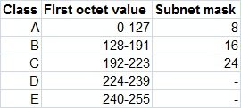 

Для IP-адресов класса А первые 8 бит (первое десятичное число) представляют сетевую часть, а остальные 24 бита-хостовую часть. Для класса B первые 16 битов (первые два числа) представляют сетевую часть, а остальные 16 битов представляют хост-часть. Для класса С первые 24 бита представляют сетевую часть, а остальные 8 бит-хостовую часть.

Рассмотрим следующие IP-адреса:

`10.50.120.7` - поскольку это адрес `класса А`, первое число (`10`) представляет сетевую часть, а остальная часть адреса представляет хост-часть (`50.120.7`). Это означает, что для того, чтобы устройства находились в одной сети, первое число их IP-адресов должно быть одинаковым для обоих устройств. В этом случае устройство с IP-адресом `10.47.8.4` находится в той же сети, что и устройство с IP-адресом, указанным выше. Устройство с IP-адресом `11.5.4.3` не находится в одной сети, так как первый номер его IP-адреса отличается.

`172.16.55.13` - поскольку это адрес `класса B`, первые два числа (`172.16`) представляют сетевую часть, а остальная часть адреса представляет хост-часть (`55.13`). Устройство с IP-адресом `172.16.254.3` находится в той же сети, а устройство с IP-адресом `172.55.54.74` - нет. 

[[открыть сайт источник]](https://study-ccna.com/classes-of-ip-addresses/) 

[[ВЕРНУТЬСЯ К СОДЕРЖАНИЮ]](#Contents) 


</br>
</br>

------------------------------------------------------------------------------------------
# Что такое TCP? <a name="TCP"></a>


`TCP (Transmission Control Protocol - Протокол управления передачей)` - это стандарт, который определяет, как устанавливать и поддерживать сетевой диалог, с помощью которого прикладные программы могут обмениваться данными. TCP работает с интернет-протоколом (`IP`), который определяет, как компьютеры отправляют пакеты данных друг другу. Вместе взятые `TCP` и `IP` являются основными правилами, определяющими интернет. Целевая группа по инженерному обеспечению Интернета (`IETF`) определяет `TCP` в документе стандартов `Request for Comment` (`RFC`) под номером `793`.

Как работает протокол управления передачей

`TCP` - это протокол, ориентированный на соединение, который означает, что соединение устанавливается и поддерживается до тех пор, пока прикладные программы на каждом конце не закончат обмениваться сообщениями. Он определяет, как разбить прикладные данные на пакеты, которые могут доставить сети, отправляет пакеты и принимает пакеты с сетевого уровня, управляет управлением потоком и-поскольку он предназначен для обеспечения безошибочной передачи данных-обрабатывает повторную передачу отброшенных или искаженных пакетов и подтверждает все пакеты, которые поступают. В модели связи `Open Systems Interconnection` (`OSI`) TCP охватывает части `уровня 4`(`транспортного уровня`) и `части уровня 5`(`уровня сеанса`).

Например, когда веб-сервер отправляет клиенту `HTML-файл`, он использует для этого протокол передачи гипертекста (`HTTP`). `Уровень программы HTTP` запрашивает `уровень TCP` для настройки соединения и отправки файла. `Стек TCP` делит файл на пакеты данных, нумерует их и затем пересылает отдельно на уровень IP для доставки. Хотя каждый пакет в передаче имеет один и тот же IP-адрес источника и назначения, пакеты могут быть отправлены по нескольким маршрутам. `Программный уровень TCP` на клиентском компьютере ожидает, пока не поступят все пакеты, затем подтверждает те, которые он получает, и запрашивает повторную передачу любого из них - на основе отсутствующих номеров пакетов. Затем `уровень TCP` собирает пакеты в файл и доставляет его в принимающее приложение.

 

Этот процесс обнаружения ошибок - повторная передача и переупорядочивание пакетов после их поступления-может привести к задержке в `потоке TCP`. Высокочувствительные к времени приложения, такие как `voice over IP` (`VoIP`), потоковое видео и игры, как правило, полагаются на транспортный процесс, такой как протокол пользовательских дейтаграмм (`UDP`), поскольку он уменьшает задержку и дрожание-вариацию задержки-не беспокоясь о переупорядочивании пакетов или повторной передаче недостающих данных.

`UDP` классифицируется как протокол дейтаграмм или протокол без подключения, поскольку он не может определить, завершили ли оба приложения свою обратную связь или нет. Вместо исправления неверных пакетов данных, как это делает `TCP`, `UDP` просто отбрасывает эти пакеты и переносит их на уровень приложения для более детального обнаружения ошибок.

**Для чего используется протокол `TCP`** 

`TCP` используется для организации данных таким образом, чтобы обеспечить безопасную передачу между сервером и клиентом. Это гарантирует целостность данных, передаваемых по сети, независимо от их объема. По этой причине он используется для передачи данных из других протоколов более высокого уровня, которые требуют, чтобы все передаваемые данные поступали. Примеры включают в себя:

`Secure Shell` (`SSH`), протокол передачи файлов (`FTP`), `Telnet`: для однорангового обмена файлами и, в случае `Telnet`, входа в компьютер другого пользователя для доступа к файлу.

Простой протокол передачи почты (`SMTP`), почтовый протокол (`POP`), протокол доступа к интернет-сообщениям (`IMAP`): для отправки и получения электронной почты, `HTTP`: для веб-доступа.

Все эти примеры существуют на `прикладном уровне` стека `TCP/IP` и отправляют данные вниз в `TCP` на `транспортном уровне`.

**Почему `TCP` так важен** 

Протокол `TCP` важен тем, что он устанавливает правила и стандартные процедуры передачи информации через интернет. Это основа для интернета в том виде, в каком он существует сегодня, и гарантирует, что передача данных осуществляется равномерно, независимо от местоположения, используемого оборудования или программного обеспечения. По этой причине он является гибким и высоко масштабируемым, что означает, что в него могут быть введены новые протоколы, и он будет их адаптировать. Он также является непатентованным, то есть им не владеет ни один человек или компания.

**Расположение в стеке `TCP / IP`** 

Стек `TCP/IP` - это модель, которая представляет, как данные организуются и обмениваются по сетям с использованием протокола `TCP/IP`. Он изображает ряд слоев, которые представляют способ обработки и упаковки данных с помощью ряда протоколов, когда они перемещаются от клиента к серверу и наоборот. 
Как и `модель OSI`, стек является концептуальной моделью для стандартов обмена данными, причем данные переупаковываются на каждом уровне на основе его функциональности и транспортных протоколов.

Разница между этими двумя моделями заключается в уровне специфичности. Модель OSI-это более абстрактное представление способа обмена данными, а не специфическое для какого-либо протокола. Это основа для общих сетевых систем. Стек `TCP/IP` является более специфичным и состоит из доминирующего набора протоколов, используемых для обмена данными. `OSI` является абстрактным и более функциональным, в то время как стек `TCP/IP` является конкретным и основан на протоколе. `Модель OSI` имеет семь уровней, в то время как модель `TCP/IP` имеет только четыре.

Запросы поступают на сервер через стек, начиная с уровня приложения в виде данных. Оттуда информация разбивается на пакеты различных типов на каждом уровне. Данные перемещаются:

* от приложения до транспортного уровня, где оно сортируется на сегменты `TCP`;
* на уровень интернета, где он становится дейтаграммой;
* на уровень сетевого интерфейса, где он снова распадается на биты и фреймы; 
* и наконец, сервер отвечает, и информация проходит вверх по стеку, чтобы прибыть на уровень приложения в виде данных. 

`TCP` существует на транспортном уровне вместе с другими протоколами, такими как `UDP`. Протоколы этого уровня обеспечивают безошибочную передачу данных к источнику, за исключением UDP, поскольку он имеет более ограниченную возможность проверки ошибок. Заголовок дейтаграммы UDP содержит гораздо меньше информации, чем заголовок сегмента TCP, и проходит гораздо меньшую обработку на транспортном уровне в интересах уменьшения задержки. 

[[открыть сайт источник]](https://searchnetworking.techtarget.com/definition/TCP) 

[[ВЕРНУТЬСЯ К СОДЕРЖАНИЮ]](#Contents) 


</br>
</br>


------------------------------------------------------------------------------------------
# Что такое UDP?  <a name="UDP"></a>
 

`UDP` - это коммуникационный протокол, используемый через Интернет для особо чувствительных к времени передач, таких как воспроизведение видео или поиск `DNS`. Он ускоряет обмен данными, не требуя так называемого” рукопожатия", позволяя передавать данные до того, как принимающая сторона согласится на обмен данными. Это позволяет протоколу работать очень быстро, а также создает отверстие для эксплуатации.

 

`TCP` - соединение, которое обычно используется для загрузки содержимого веб-страницы, требует рукопожатия, в котором получатель соглашается на связь до отправки данных. `UDP` же будет отправлять данные без подтверждения, даже если запрос является мошенническим.

`UDP` не имеет функции проверки ошибок и упорядочения `TCP` и лучше всего используется, когда проверка ошибок не требуется и важна скорость. Этот встроенный недостаток надежности является причиной того, что `UDP` иногда называют `ненадежным протоколом датаграмм`.

Введенный в 1980 году, `UDP` является одним из старейших сетевых протоколов, все еще используемых. Приложения, использующие UDP, должны быть способны переносить ошибки, потери и дублирование. Хотя это звучит не совсем идеально, есть несколько приложений, где более быстрый и менее надежный протокол является лучшим выбором.

Какие виды услуг полагаются на UDP?

UDP обычно используется в чувствительных ко времени сообщениях, где иногда отбрасывание пакетов лучше, чем ожидание. Голосовой и видеотрансляционный трафик передаются с использованием этого протокола, поскольку они оба чувствительны ко времени и предназначены для обработки некоторого уровня потерь. Например, `VoIP` (`voice over IP`), который используется многими интернет-телефонными службами, работает через `UDP`. Это происходит потому, что статичный телефонный разговор предпочтительнее того, который кристально чист, но сильно задерживается. Это также делает `UDP` идеальным протоколом для онлайн-игр. Точно так же, поскольку `DNS` и `NTP-серверы` должны быть быстрыми и эффективными, они работают через `UDP`. Объемные DDoS-атаки, включая усиление `DNS` и усиление `NTP`, используют уязвимые экземпляры этих серверов с целью затопления цели `UDP-трафиком`. 

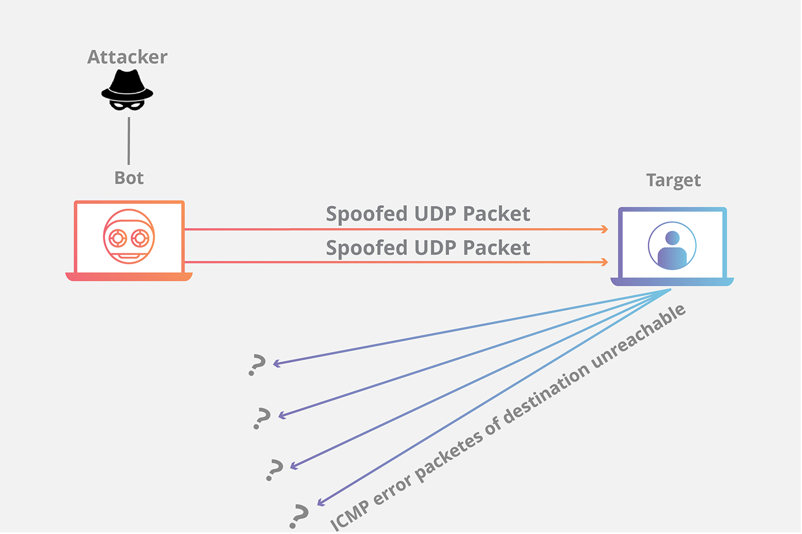 

[[открыть сайт источник]](https://www.cloudflare.com/learning/ddos/glossary/user-datagram-protocol-udp/) 

[[ВЕРНУТЬСЯ К СОДЕРЖАНИЮ]](#Contents) 


</br>
</br>

------------------------------------------------------------------------------------------
# Что такое сетевые уровни? <a name="networklayers"></a>


Сетевые соединения - это то, что делает Интернет возможным. `Сетевой уровень` - это часть процесса интернет-коммуникации, в которой эти соединения происходят, передавая пакеты данных туда и обратно между различными сетями. В 7-слойной модели `OSI` (см. ниже) сетевым уровнем является Уровень 3. Интернет-протокол (IP) является одним из основных протоколов, используемых на этом уровне, наряду с несколькими другими протоколами для маршрутизации, тестирования и шифрования.

Предположим, что где то есть `Боб` и `Алиса`, которые подключены к одной локальной сети (`LAN`), и `Боб` хочет отправить `Алисе` сообщение. Поскольку `Боб` находится в той же сети, что и `Алиса`, он может отправить его прямо на ее компьютер через сеть. Однако, если `Алиса` вместо этого находится в другой локальной сети на расстоянии нескольких миль, сообщение `Боба` должно быть адресовано и отправлено в сеть `Алисы`, прежде чем оно сможет достичь ее компьютера, что является процессом сетевого уровня.


Что такое сеть? Сеть - это группа из двух или более подключенных вычислительных устройств. Обычно все устройства в сети подключаются к центральному концентратору-например, маршрутизатору. Сеть также может включать подсети или более мелкие подразделения сети. Подсети - это то, как очень большие сети, такие как те, которые предоставляют интернет-провайдеры, могут управлять тысячами IP-адресов и подключенных устройств.

Представьте себе Интернет как сеть сетей: компьютеры соединены друг с другом внутри сетей, и эти сети соединяются с другими сетями. Это позволяет этим компьютерам подключаться к другим компьютерам как близко, так и далеко.


Что происходит на сетевом уровне? Все, что связано с межсетевыми соединениями, происходит на сетевом уровне. Это включает в себя настройку маршрутов передачи пакетов данных, проверку работоспособности сервера в другой сети, а также адресацию и прием IP-пакетов из других сетей. Этот последний процесс, пожалуй, самый важный, так как подавляющее большинство интернет-трафика передается по IP-адресу.

Что такое пакет? Все данные, передаваемые через Интернет, разбиваются на более мелкие фрагменты, называемые "пакетами".- Когда `Боб` посылает `Алисе` сообщение, например, его сообщение разбивается на более мелкие части, а затем снова собирается на компьютере `Алисы`. Пакет состоит из двух частей: `заголовка`, который содержит информацию о самом пакете, и `тела`, которое является фактическими передаваемыми данными.

На сетевом уровне сетевое программное обеспечение прикрепляет `заголовок` к каждому пакету, когда пакет отправляется через Интернет, а на другом конце сетевое программное обеспечение может использовать `заголовок`, чтобы понять, как обрабатывать пакет.

`Заголовок` содержит информацию о содержимом, источнике и месте назначения каждого пакета (что-то вроде штамповки конверта с указанием адреса назначения и обратного адреса). Например, IP-заголовок содержит IP-адрес назначения каждого пакета, общий размер пакета, указание на то, был ли пакет фрагментирован (разбит на еще более мелкие части) во время передачи, а также подсчет количества сетей, через которые прошел пакет.

[[открыть сайт источник]](https://www.cloudflare.com/learning/access-management/what-is-the-network-layer/) 

[[ВЕРНУТЬСЯ К СОДЕРЖАНИЮ]](#Contents) 


</br>
</br>


------------------------------------------------------------------------------------------
# Что такое модель OSI? <a name="OSI"></a>


Модель межсоединения открытых систем (`OSI`) - это описание того, как работает интернет. Он разбивает функции, связанные с отправкой данных через Интернет, на семь уровней. Каждый слой имеет некоторую функцию, которая подготавливает данные для передачи по проводам, кабелям и радиоволнам в виде серии битов.


Семь уровней модели `OSI` являются:

* `Прикладной уровень`: данные, генерируемые и используемые программными приложениями. Основным протоколом, используемым на этом уровне, является `HTTP`.
* `Уровень представления`: данные переводятся в форму, которую может принять приложение. Некоторые авторитетные источники считают, что шифрование и дешифрование `HTTPS` происходит на этом уровне.
* `Уровень сеанса`: управляет соединениями между компьютерами (это также может быть обработано на уровне 4 протоколом `TCP`).
* `Транспортный уровень`: обеспечивает средства передачи данных между двумя подключенными сторонами, а также контроль качества обслуживания. Основными протоколами, используемыми здесь, являются TCP и UDP.
* `Сетевой уровень`: обрабатывает маршрутизацию и отправку данных между различными сетями. Наиболее важными протоколами на этом уровне являются `IP`, `ICMP`, `ARP` и `BGP`.
* `Уровень канала передачи данных`: обрабатывает связь между устройствами в одной сети. Если Уровень 3 подобен адресу на почтовом листе, то уровень 2 подобен указанию номера офиса или квартиры по этому адресу. Здесь чаще всего используется протокол `Ethernet`.
* `Физический уровень`: пакеты преобразуются в электрические, радио или оптические импульсы и передаются в виде битов (наименьших возможных единиц информации) по проводам, радиоволнам или кабелям. 


Важно иметь в виду, что модель `OSI` - это абстрактная концептуализация процессов, которые заставляют интернет работать, а интерпретация и применение модели к реальному интернету иногда является субъективным упражнением.

Модель `OSI` полезна для того, чтобы помочь людям говорить о сетевом оборудовании и протоколах, определить, какие протоколы используются в том или ином программном и аппаратном обеспечении, и примерно показать, как работает интернет. Но это не жесткое пошаговое определение того, как всегда функционируют интернет-соединения.


**Модели `OSI` и модели `TCP/IP`**  

Модель `TCP/IP` - это альтернативная модель работы Интернета. Он делит процессы, связанные с этим, на четыре слоя вместо семи. Некоторые утверждают, что модель `TCP/IP` лучше отражает то, как функционирует Интернет сегодня, но `модель OSI` все еще широко используется для понимания интернета, и обе модели имеют свои сильные и слабые стороны.

В модели `TCP/IP` эти четыре уровня являются:

* `Прикладной уровень`: это примерно соответствует `уровню 7` в модели `OSI`.
* `Транспортный уровень`: соответствует `уровню 4` в модели `OSI`.
* `Уровень интернета`: соответствует `уровню 3` в модели `OSI`.
* `Уровень доступа к сети`: объединяет процессы уровней `1` и `2` в модели `OSI`.  

Но где находятся уровни `OSI` 5 и 6 в модели `TCP/IP`? Некоторые источники утверждают, что процессы на уровнях `OSI` 5 и 6 либо больше не нужны в современном Интернете, либо фактически принадлежат слоям 7 и 4 (представленным слоями 4 и 3 в модели `TCP/IP`).

Например, поскольку протокол `TCP` открывает и поддерживает сеансы на уровне OSI `4`, можно считать, что уровень OSI `5` (`уровень" сеанса`) не нужен — и он не представлен в модели `TCP/IP`. Кроме того, шифрование и дешифрование `HTTPS` можно рассматривать как процесс прикладного уровня (`OSI layer 7` или `TCP/IP layer 4`) вместо процесса уровня представления (`OSI layer 6`).

**В чем разница между уровнем "сеть" и уровнем "интернет"?**  

В модели TCP/IP нет никакого `сетевого уровня`. Вместо `Сетевого уровеня модели OSI` у модели TCP/IP существует `интернет-уровень`. В модели OSI сетевой уровень - это `Уровень 3`; в модели TCP/IP интернет-уровень - это `уровень 2`.

Другими словами, `сетевой уровень` и `интернет-уровень` - это в основном одно и то же, но они исходят из разных моделей того, как работает интернет.

Какие протоколы используются на сетевом уровне? Протокол - это согласованный способ форматирования данных таким образом, чтобы два или более устройства могли взаимодействовать и понимать друг друга. Ряд различных протоколов делают возможными соединения, тестирование, маршрутизацию и шифрование на сетевом уровне, в том числе:

* `IP`
* Протокол `IPSec`
* протокол `ICMP`
* `IGMP`
* `BGP`
* `АРП`
* `РАЗРЫВ`
* `GRE`


**Как `Cloudflare` защищает сетевой уровень?**  

Поскольку они подвержены воздействию остальной части интернета, инфраструктура сетевого уровня уязвима для внешних атак, особенно распределенных атак типа `отказ в обслуживании` (`DDoS`). Маршрутизаторы, коммутаторы и другие сетевые интерфейсы могут быть перегружены или скомпрометированы вредоносным сетевым трафиком, и почти любой из вышеперечисленных сетевых протоколов может быть использован в атаке.

`Cloudflare Magic Transit` защищает сетевую инфраструктуру, используя ту же технологию, которая поддерживает более 27 000 000 веб-свойств в рабочем состоянии перед лицом `эксплойт уязвимостей` и `DDoS-атак`. Он расширяет защиту `Cloudflare` на локальные сети и сети центров обработки данных, обеспечивая безопасность организаций от атак сетевого уровня.  

[[открыть сайт источник]](https://www.cloudflare.com/learning/access-management/what-is-the-network-layer/)  

[[ВЕРНУТЬСЯ К СОДЕРЖАНИЮ]](#Contents)  


</br>
</br>

------------------------------------------------------------------------------------------
# Что такое DHCP-сервер и протокол DHCP? <a name="DHCP"></a>


Протокол динамической конфигурации хоста (`DHCP`) - это сетевой протокол, который функционирует на прикладном уровне пакета `Internet Protocol (IP)`. Сервер, использующий `DHCP`, сможет динамически назначать IP-адреса и другие параметры конфигурации сети устройствам в Сети; Таким образом, обеспечивая связь со второй сетью. Протокол может быть реализован в сетях любого размера, начиная от небольших `домашних сетей (HANs)` и заканчивая большими `кампусными сетями (CANs)` и даже сетями, используемыми `интернет-провайдерами (ISP)`.

Как работает `DHCP`? `DHCP` работает в режиме клиент-сервер, где сервер настраивает пул доступных IP-адресов для сети. `DHCP-сервер` также предоставляет `сетевой шлюз`, `маски подсети`, `серверы имен` и `количество времени ("аренда")`, в течение которого данный IP-адрес будет действителен. `DHCP-клиент` извлекает эти параметры и использует их для присоединения к существующей сети. В домах и небольших офисах маршрутизатор также действует как `DHCP-сервер`. В более крупной сети выделенный сервер может выступать в качестве `DHCP-сервера` наряду с выполнением других серверных действий.


Процесс получения `IP-адреса` от `DHCP-сервера` происходит следующим образом:

* Компьютер (клиент), настроенный для использования DHCP, отправляет запрос обнаружения DHCP в сеть.
* DHCP-сервер получает запрос обнаружения DHCP, ищет доступный список IP-адресов и выбирает IP-адрес для назначения. 
* DHCP-сервер пытается найти тот же IP-адрес для клиента, если ему был назначен IP-адрес ранее. 
* DHCP-сервер отправляет клиенту ответ на предложение DHCP.
* Клиент получает ответ на предложение DHCP и отвечает на DHCP-сервер, отправляя пакет запроса DHCP для принятия предложения.
* DHCP-сервер отправляет пакет ACK (confirm) для подтверждения назначения IP-адреса. 
* Если IP-адрес больше не доступен, пакет NACK (No confirm) отправляется, и процесс повторяется до тех пор, пока клиент не получит действительный IP-адрес от сервера.


Каковы преимущества использования `DHCP`? Компьютер, планшет или смартфон, которым необходимо подключиться к существующей (домашней или офисной) сети, должен быть правильно настроен для связи с другими устройствами в сети. Ручная настройка статических адресов `IPv4` или `IPv6` вместе с информацией о конкретной сети приводит к человеческим ошибкам, поскольку требуется ввести значительное количество цифр. Кроме того, ручная настройка может привести к назначению одного и того же IP-адреса нескольким устройствам, что приведет к конфликту IP-адресов. `DHCP` автоматизирует этот громоздкий ручной процесс и назначает IP-адрес динамически. Вы также можете заинтересоваться чтением статических и динамических IP-адресов.

`DHCP` позволяет сетевым администраторам централизованно управлять и автоматизировать назначение IP-адресов, не беспокоясь о назначении дубликата IP-адреса нескольким компьютерам и повторном вводе сетевого шлюза, маски подсети и другой связанной с сетью информации на каждый компьютер, что значительно упрощает управление сетевым администрированием.

Как узнать, используете ли вы `DHCP`
Если вы хотите знать, используете ли вы динамический или статический IP-адрес, вы можете использовать команду `ipconfig` в `Windows`. На компьютерах `MAC` или `Linux` можно использовать команду `ifconfig`.


На компьютере с `Windows` вывод команды `ipconfig` будет выглядеть примерно так. 

```
C:\>ipconfig /all

Windows IP Configuration

        Host Name . . . . . . . . . . . . : iplocation
        Primary Dns Suffix  . . . . . . . :
        Node Type . . . . . . . . . . . . : Hybrid
        IP Routing Enabled. . . . . . . . : No
        WINS Proxy Enabled. . . . . . . . : No

Ethernet adapter Wireless Network Connection:

        Connection-specific DNS Suffix  . :
        Description . . . . . . . . . . . : Intel(R) PRO/Wireless LAN 2100 3B Mi
ni PCI Adapter
        Physical Address. . . . . . . . . : 00-0C-F1-65-5B-70
        Dhcp Enabled. . . . . . . . . . . : Yes
        Autoconfiguration Enabled . . . . : Yes
        IP Address. . . . . . . . . . . . : 192.168.1.100
        Subnet Mask . . . . . . . . . . . : 255.255.255.0
        Default Gateway . . . . . . . . . : 192.168.1.1
        DHCP Server . . . . . . . . . . . : 192.168.1.1
        DNS Servers . . . . . . . . . . . : 192.168.1.1
        Lease Obtained. . . . . . . . . . : Thursday, February 08, 2007 2:27:17 PM
        Lease Expires . . . . . . . . . . : Thursday, February 15, 2007 2:27:17 PM
```
  


На компьютерах Mac и Linux вывод команды ifconfig будет выглядеть следующим образом. 

```
bash %>ifconfig
eth0      Link encap:Ethernet  HWaddr F2:3C:91:DB:8A:88
          inet addr:192.168.1.96  Bcast:192.168.1.255  Mask:255.255.255.0
          UP BROADCAST RUNNING MULTICAST  MTU:1500  Metric:1
          RX packets:27522604 errors:0 dropped:0 overruns:0 frame:0
          TX packets:27666143 errors:0 dropped:0 overruns:0 carrier:0
          collisions:0 txqueuelen:1000
          RX bytes:2704290926 (2.5 GiB)  TX bytes:52580665594 (48.9 GiB)

lo        Link encap:Local Loopback
          inet addr:127.0.0.1  Mask:255.0.0.0
          inet6 addr: ::1/128 Scope:Host
          UP LOOPBACK RUNNING  MTU:65536  Metric:1
          RX packets:17632 errors:0 dropped:0 overruns:0 frame:0
          TX packets:17632 errors:0 dropped:0 overruns:0 carrier:0
          collisions:0 txqueuelen:1
          RX bytes:2249069 (2.1 MiB)  TX bytes:2249069 (2.1 MiB)
```

**Структура и функциональность**  

`DHCP-сервер` выполняет свою функцию, позволяя устройствам в своей сети запрашивать IP-адреса и другие сетевые конфигурации у провайдера. Этот процесс позволяет сети функционировать без необходимости в том, чтобы сетевой администратор вручную назначал `IP-адреса` каждому устройству в сети. Протокол был разработан с учетом модели клиент-сервер, и поэтому всякий раз, когда устройство подключается к сети, программное обеспечение `клиента DHCP` будет транслировать запрос на все устройства в сети для запроса информации. 

Запрос распознается любым DHCP-сервером` в сети, который будет управлять `списком IP-адресов` и другими важными настройками конфигурации по умолчанию, такими как шлюз по умолчанию, доменное имя, серверы времени и серверы имен. Сервер, который распознает запрос, может ответить соответствующей информацией для каждого клиента; информация, которая была бы предварительно настроена сетевым администратором. В том случае, если эта информация не была предварительно настроена сетевым администратором, он вместо этого ответит определенным адресом и любой другой информацией, которая подходит для всей сети и для продолжительности действительного периода времени.

 Эти запросы обычно отправляются сразу после загрузки клиента и периодически после того, как информация достигает истечения срока действия. Следует также отметить, что всякий раз, когда клиент запрашивает новую информацию для назначения, он обычно запрашивает те же значения, но это может быть изменено сетевым администратором в зависимости от политик назначения, настроенных на сервере.

Распределение `IP-адресов` может быть выполнено одним из трех способов в зависимости от реализации `DHCP-сервера`. Динамическое распределение выполняется сетевым администратором, обозначающим диапазон IP-адресов, используемых сервером для выдачи клиентам в течение выделенного периода времени. Этот процесс запроса и предоставления действует как аренда, где сервер может восстановить адреса, которые не были продлены клиентом для перераспределения другим клиентам.

Автоматическое распределение аналогично динамическому распределению, поскольку администратор сети устанавливает диапазон `IP-адресов` для использования сервером; однако эти адреса постоянно привязаны к клиентам, которые подключаются к серверу. Это означает, что сервер также будет вести запись о том, какие адреса привязаны к каким клиентам, чтобы при повторном подключении клиента к этому серверу он мог получить тот же `IP-адрес`, что и при последнем подключении.

Наконец, ручное (или статическое) распределение выполняется сетевым администратором, устанавливающим схему сопоставления для использования сервером. После настройки сервер выдает каждому клиенту частный IP-адрес, основанный на его `MAC-адресе` управления доступом к мультимедиа. В том случае, если совпадение с `MAC-адресом` клиента не может быть сопоставлено, сервер может использовать вместо этого один из других методов распределения.

Протокол используется как для `IPv4`, так и для `IPv6` и выполняет одни и те же задачи в обеих версиях, но детали для каждого из них достаточно различны, чтобы их можно было рассматривать как два отдельных протокола. Независимо от этого, протокол использует протокол пользовательских дейтаграмм (`UDP`) для использования бесконтактной модели. Он использует два номера портов `UDP` для своих операций, номер порта 67 используется для сервера, а 68-для клиента. Затем эти операции можно разделить на четыре этапа: обнаружение сервера, предложение аренды `IP-адреса`, запрос аренды `IP-адреса` и подтверждение аренды IP-адреса. Общепринятая аббревиатура, используемая для описания этих фаз, - это `DORA`, что означает открытие, предложение, запрос и подтверждение.

На этапе обнаружения клиент передает сообщение `DHCPDISCOVER` всем устройствам в сети, используя адрес `255.255.255.255` или конкретный широковещательный адрес подсети. Следует также отметить, что клиент также может запросить свой последний известный `IP-адрес`, но результаты могут отличаться. Если клиент находится в той же сети, что и при первом подключении, его запрос будет подтвержден без проблем; однако если это не так, то это будет зависеть от того, является ли сервер авторитетным или нет. Авторитетный `DHCP-сервер` отклонит запрос и заставит клиента запросить новый адрес, в то время как неавторитетный `DHCP-сервер` проигнорирует запрос, который может привести к `тайм-ауту` для клиента, в зависимости от того, был ли он реализован, и попросит их запросить новый `IP-адрес`.

Во время фазы предложения `DHCP-сервер` получает сообщение `DHCPDISCOVER` от клиента в сети и отвечает, зарезервировав IP-адрес для клиента, а также отвечает клиенту сообщением `DHCPOFFER`. Этот ответ-предложение будет содержать IP-адрес, маску подсети, время действия аренды, `MAC-адрес` клиента и `IP-адрес сервера`.

В ответ на предложение, сделанное `DHCP-сервером`, клиент отвечает сообщением `DHCPREQUEST` для входа в фазу запроса. Это сообщение означает, что клиент принимает предложение сервера, но следует отметить, что, хотя клиент может получать многочисленные предложения от многочисленных серверов, он может выдать только один запрос на принятие одного из предложений. В зависимости от опции идентификации сервера в запросе и широковещательном обмене сообщениями все `DHCP-серверы` могут быть проинформированы о том, какое предложение принял клиент. Это позволяет серверам, у которых могут быть отложенные предложения, отозвать их и вернуть зарезервированный `IP-адрес` обратно в свой пул доступных адресов.

Наконец, как только сервер получает сообщение `DHCPREQUEST` в качестве акцепта своего предложения от клиента, процесс переходит в фазу подтверждения, заставляя сервер отправить сообщение `DHCPACK` обратно клиенту. Это сообщение будет включать в себя срок аренды и любые другие параметры конфигурации, которые клиент мог бы запросить,и завершит процесс.

Следует также отметить, что можно настроить `ретранслятор DHCP` или `помощник DHCP`, если клиент и сервер находятся в разных подсетях внутри сети. В этих сценариях сообщение `DHCPDISCOVER` будет отправлено в подсеть, в которой находится сервер. Это достигается путем установки двух агентов ретрансляции в обеих подсетях, чтобы они могли передавать сообщения предполагаемым получателям.


**Безопасность** 

`DHCP` обычно не имеет никаких систем для авторизации и может стать жертвой трех типов атак. Несанкционированные серверы могут предоставлять клиентам ложную информацию, поскольку клиент не может идентифицировать действительный DHCP-сервер в сети. Эти мошеннические `DHCP-серверы` могут воспользоваться этим преимуществом и использоваться в атаке типа `"отказ в обслуживании" (DOS)` для предотвращения надлежащей функциональности сервера или в атаке типа "человек в середине" для получения информации. И наоборот, там также могут быть несанкционированные клиенты, получающие доступ к ресурсам, поскольку сервер также не может аутентифицировать `DHCP-клиент`. Это позволит клиентам получить IP-адрес от сервера, несмотря на то, что он не является действительным клиентом, маскируясь под него. Достаточное количество несанкционированных клиентов, делающих это, может фактически исчерпать пул адресов сервера, а также повлиять на правильную работу сети. Третья классификация атак-это повторяющиеся и исчерпывающие атаки со стороны вредоносных клиентов.

Для борьбы с этими атаками был реализован протокол `Relay Agent Information Option Protocol (также называемый Option 82)`, позволяющий сетям присоединять теги авторизации к `сообщениям DHCP`. Затем этот тег будет использоваться для управления доступом клиента к ресурсам сервера, и поскольку клиент не имеет подключения к вышестоящей сети агента ретрансляции, отсутствие проверки не помешает серверу полагаться на этот тег. Аутентификация для сообщений DHCP была еще одним нововведением, сделанным в способе проверки сообщений, хотя она не была широко распространена из-за проблем при управлении ключами для большого числа клиентов.

В целом, эти методы называются DHCP Snooping, и учитывая важность и использование протокола в ближайшее время никуда не денется, они являются отличными навыками для любого сетевого администратора.  

[[открыть сайт источник]](https://www.iplocation.net/dhcp)  

[[ВЕРНУТЬСЯ К СОДЕРЖАНИЮ]](#Contents)  


</br>
</br>


------------------------------------------------------------------------------------------
# Что такое DNS-сервер и DNS-протокол? <a name="DNS"></a>


Система доменных имен (`DNS`) - это телефонная книга Интернета. Люди получают доступ к информации в интернете через доменные имена, например nytimes.com или espn.com веб-браузеры взаимодействуют через интернет-протокол (`IP`) адресов. DNS преобразует доменные имена в IP-адреса, чтобы браузеры могли загружать интернет-ресурсы.

Каждое устройство, подключенное к интернету, имеет уникальный IP-адрес, который другие машины используют для поиска устройства. DNS-серверы устраняют необходимость для людей запоминать IP-адреса, такие как `192.168.1.1 (в IPv4)`, или более сложные новые буквенно-цифровые IP-адреса, такие как `2400:cb00:2048:1::c629:d7a2 (в IPv6)`.


**Как работает DNS?** 

Процесс разрешения DNS включает в себя преобразование имени хоста (например, www.example.com) в удобный для компьютера IP-адрес (например, 192.168.1.1). Каждому устройству в Интернете присваивается IP-адрес, и этот адрес необходим для поиска соответствующего интернет - устройства-как уличный адрес используется для поиска конкретного дома. Когда пользователь хочет загрузить веб-страницу, перевод должен происходить между тем, что пользователь вводит в свой веб-браузер (example.com) и дружественный к машинам адрес, необходимый для определения местоположения example.com веб-страница.

Чтобы понять процесс, стоящий за разрешением DNS, важно узнать о различных аппаратных компонентах, между которыми должен проходить запрос DNS. Для веб-браузера поиск DNS происходит "за кулисами" и не требует никакого взаимодействия с компьютером пользователя, кроме первоначального запроса.


В загрузке веб-страницы участвуют 4 DNS-сервера:
* `DNS-рекурсор` - рекурсор может рассматриваться как библиотекарь, которого просят найти определенную книгу где-то в библиотеке. `DNS recursor` - это сервер, предназначенный для приема запросов от клиентских машин через такие приложения, как веб-браузеры. Обычно рекурсор несет ответственность за выполнение дополнительных запросов для удовлетворения DNS-запроса клиента.
* `Root nameserver` - корневой сервер является первым шагом в переводе (разрешении) удобочитаемых имен хостов в IP-адреса. Его можно рассматривать как указатель в библиотеке, который указывает на разные стеллажи с книгами - обычно он служит ссылкой на другие более конкретные места.
* `TLD nameserver` - доменный сервер верхнего уровня (TLD) можно рассматривать как определенный стеллаж с книгами в библиотеке. Этот сервер имен является следующим шагом в поиске определенного IP-адреса, и на нем размещается последняя часть имени хоста (In example.com, сервер TLD - это "com").
* `Авторитетный сервер имен` - этот конечный сервер имен можно рассматривать как словарь на стеллаже с книгами, в котором конкретное имя может быть переведено в его определение. Авторитетный сервер имен - это последняя остановка в запросе сервера имен. Если авторитетный сервер имен имеет доступ к запрошенной записи, он вернет IP-адрес для запрошенного имени хоста обратно DNS-Рекурсору (библиотекарю), который сделал первоначальный запрос. 


**В чем разница между авторитетным DNS-сервером и рекурсивным DNS-решателем?** 

Обе концепции относятся к серверам (группам серверов), которые являются неотъемлемой частью инфраструктуры DNS, но каждый выполняет свою роль и живет в разных местах внутри конвейера DNS-запроса. Один из способов понять разницу заключается в том, что рекурсивный преобразователь находится в начале DNS-запроса, а авторитетный сервер имен-в конце.


**Рекурсивный DNS-решатель** 

Рекурсивный преобразователь-это компьютер, который отвечает на рекурсивный запрос клиента и тратит время на отслеживание записи DNS. Он делает это, делая серию запросов, пока не достигнет авторитетного DNS-сервера имен для запрошенной записи (или тайм-аут или возвращает ошибку, если запись не найдена). К счастью, рекурсивные DNS-преобразователи не всегда должны выполнять несколько запросов для отслеживания записей, необходимых для ответа клиенту; кэширование-это процесс сохранения данных, который помогает закоротить необходимые запросы, обслуживая запрошенную запись ресурса ранее в поиске DNS. 

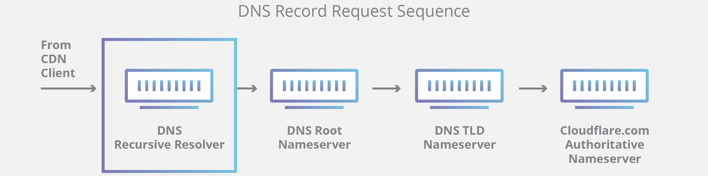 

Авторитетный DNS-сервер
Проще говоря, авторитетный DNS-сервер-это сервер, который фактически содержит записи ресурсов DNS и отвечает за них. Это сервер в нижней части цепочки поиска DNS, который будет отвечать с запрашиваемой записью ресурса, в конечном счете позволяя веб-браузеру, делающему запрос, достичь IP-адреса, необходимого для доступа к веб-сайту или другим веб-ресурсам. Авторитетный сервер имен может удовлетворять запросы из своих собственных данных без необходимости запрашивать другой источник, поскольку он является конечным источником истины для определенных записей DNS. 

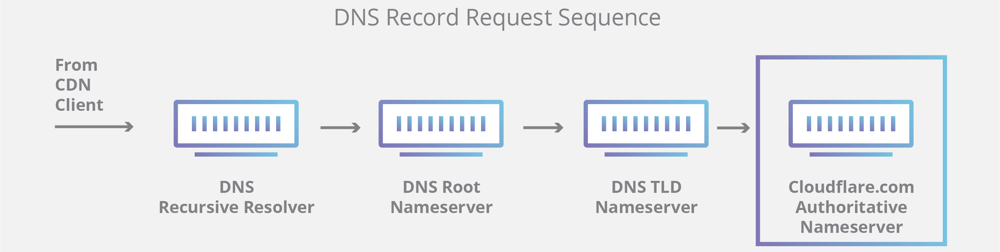 

Стоит отметить, что в тех случаях, когда запрос относится к поддомену, например `foo.example.com` или `blog.cloudflare.com`, дополнительный сервер имен будет добавлен в последовательность после авторитетного сервера имен, который отвечает за хранение записи CNAME поддомена. 

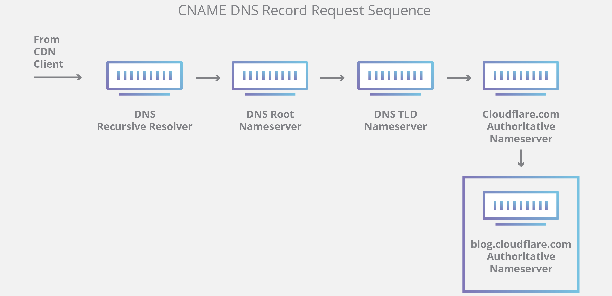 

Существует ключевое различие между многими службами DNS и той, которую предоставляет `Cloudflare`. Различные `DNS-рекурсивные преобразователи`, такие как `Google DNS`, `OpenDNS` и поставщики, такие как `Comcast`, поддерживают установку центров обработки данных `DNS-рекурсивных преобразователей`. Эти преобразователи позволяют быстро и легко выполнять запросы через оптимизированные кластеры DNS-оптимизированных компьютерных систем, но они принципиально отличаются от серверов имен, размещенных в `Cloudflare`.

`Cloudflare` поддерживает серверы имен на уровне инфраструктуры, которые являются неотъемлемой частью функционирования Интернета. Одним из основных примеров является `F-root`(корневой сервер сети), который `Cloudflare` является частично ответственным за проведение. `F-root` - это один из компонентов инфраструктуры DNS-серверов имен корневого уровня, отвечающий за миллиарды интернет-запросов в день. Наша сеть `Anycast` предоставляет нам уникальную возможность обрабатывать большие объемы DNS-трафика без прерывания обслуживания.

**Каковы шаги в поиске DNS?** 

В большинстве случаев DNS связан с тем, что доменное имя переводится в соответствующий IP-адрес. Чтобы узнать, как работает этот процесс, он помогает проследить путь поиска DNS, когда он перемещается из веб-браузера, через процесс поиска DNS и обратно. Давайте взглянем на ступеньки.

> *Примечание*:
>
> Часто информация поиска DNS будет кэшироваться либо локально внутри запрашивающего компьютера, либо удаленно в инфраструктуре DNS. Обычно существует 8 шагов в поиске DNS. Когда информация DNS кэшируется, шаги пропускаются из процесса поиска DNS, что делает его более быстрым. В приведенном ниже примере описываются все 8 шагов, когда ничего не кэшируется.


8 шагов в поиске DNS: 
1. Тип пользователя ‘example.com " в веб-браузер, и запрос перемещается в Интернет и принимается рекурсивным распознавателем DNS.
2. Затем решатель запрашивает корневой DNS-сервер имен (.).
3. Затем корневой сервер отвечает решателю адресом DNS-сервера домена верхнего уровня (TLD) (например,. com или .net), который хранит информацию для своих доменов. При поиске example.com, наш запрос направлен в сторону дву .com.
4. Затем решатель делает запрос к дву .com.
5. Затем сервер дву отвечает IP-адресом сервера имен домена, example.com-да.
6. Наконец, рекурсивный преобразователь отправляет запрос на сервер имен домена.
7. IP-адрес для example.com затем он возвращается в решатель с сервера имен.
8. Затем распознаватель DNS отвечает веб-браузеру с помощью IP-адреса домена, запрошенного изначально.  

После того, как 8 шагов поиска DNS вернули IP-адрес для example.com, браузер может сделать запрос на веб-страницу:  
9. Браузер делает HTTP-запрос на IP-адрес.  
10. Сервер на этом IP-адресе возвращает веб-страницу, которая будет отображаться в браузере.  

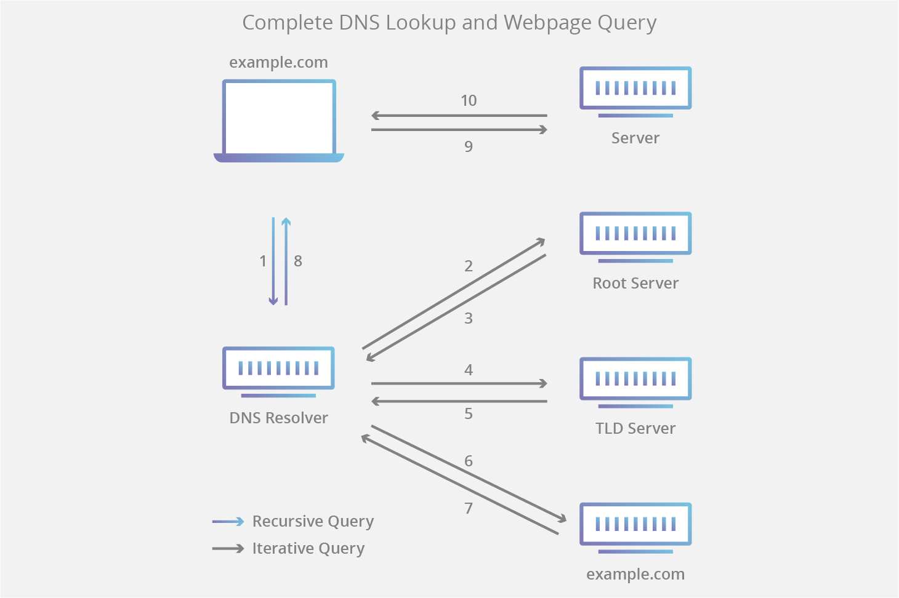  


**Что такое DNS-решатель?**  

Распознаватель DNS является первой остановкой в поиске DNS, и он отвечает за работу с клиентом, который сделал первоначальный запрос. Решатель запускает последовательность запросов, которая в конечном итоге приводит к переводу URL-адреса в необходимый IP-адрес.

*Примечание*: типичный кэше DNS-запросов будет включать в себя как рекурсивные и итеративные запросы.

Важно различать рекурсивный DNS-запрос и рекурсивный DNS-решатель. Запрос относится к запросу, сделанному к DNS-решателю, требующему разрешения запроса. Рекурсивный распознаватель DNS - это компьютер, который принимает рекурсивный запрос и обрабатывает ответ, делая необходимые запросы.  

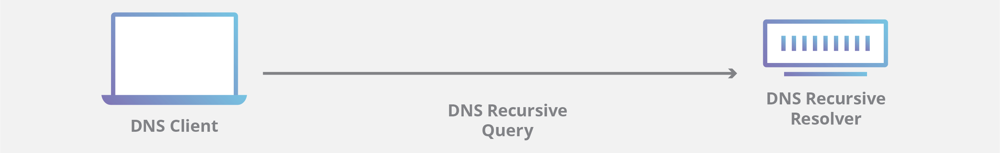  


**Каковы типы DNS-запросов?**  

В типичном поиске DNS встречаются три типа запросов. При использовании комбинации этих запросов оптимизированный процесс разрешения DNS может привести к сокращению пройденного расстояния. В идеальном случае будут доступны кэшированные данные записей, что позволит серверу DNS-имен возвращать нерекурсивный запрос.

3 типа DNS-запросов:  

* Рекурсивный запрос-в рекурсивном запросе DNS-клиент требует, чтобы DNS-сервер (обычно DNS-рекурсивный преобразователь) отвечал клиенту либо запрашиваемой записью ресурса, либо сообщением об ошибке, если преобразователь не может найти эту запись.
* Итеративный запрос-в этой ситуации DNS-клиент позволит DNS-серверу вернуть наилучший ответ, который он может получить. Если запрашиваемый DNS-сервер не соответствует имени запроса,он возвращает ссылку на DNS-сервер, уполномоченный для более низкого уровня пространства имен домена. Затем DNS-клиент сделает запрос на адрес ссылки. Этот процесс продолжается с дополнительными DNS-серверами вниз по цепочке запросов до тех пор, пока не произойдет ошибка или тайм-аут.
* Нерекурсивный запрос-обычно это происходит, когда клиент DNS-решателя запрашивает DNS-сервер для записи, к которой он имеет доступ либо потому, что он является авторитетным для записи, либо потому, что запись существует внутри его кэша. Как правило, DNS-сервер кэширует DNS-записи, чтобы предотвратить дополнительное потребление пропускной способности и нагрузку на вышестоящие серверы.  


**Что такое кэширование DNS? Где происходит кэширование DNS?**  

Цель кэширования состоит в том, чтобы временно хранить данные в местоположении, что приводит к повышению производительности и надежности запросов данных. Кэширование DNS включает в себя хранение данных ближе к запрашивающему клиенту, так что DNS-запрос может быть разрешен раньше и можно избежать дополнительных запросов дальше по цепочке поиска DNS, тем самым улучшая время загрузки и уменьшая потребление пропускной способности/процессора. Данные DNS могут быть кэшированы в различных местах, в каждом из которых будут храниться записи DNS в течение заданного периода времени, определяемого временем жизни (TTL).

Современные веб-браузеры по умолчанию предназначены для кэширования записей DNS в течение заданного периода времени. цель здесь очевидна; чем ближе кэширование DNS происходит к веб-браузеру, тем меньше шагов обработки должно быть предпринято, чтобы проверить кэш и сделать правильные запросы к IP-адресу. Когда делается запрос на запись DNS, кэш браузера является первым местоположением, проверенным для запрошенной записи.

В chrome вы можете увидеть состояние вашего DNS-кэша, перейдя в `chrome://net-internals/#dns`


**Кэширование DNS на уровне операционной системы (ОС)**

Распознаватель DNS уровня операционной системы - это вторая и последняя локальная остановка перед тем, как DNS-запрос покинет вашу машину. Процесс внутри вашей операционной системы, предназначенный для обработки этого запроса, обычно называется "распознавателем заглушек" или DNS-клиентом. Когда распознаватель заглушек получает запрос от приложения, он сначала проверяет свой собственный кэш, чтобы увидеть, есть ли у него запись. Если это не так, то он отправляет DNS-запрос (с установленным рекурсивным флагом) за пределами локальной сети к рекурсивному распознавателю DNS внутри интернет-провайдера (ISP).

Когда рекурсивный преобразователь внутри провайдера получает DNS-запрос, как и все предыдущие шаги, он также проверяет, хранится ли уже запрошенная трансляция хоста в IP-адрес внутри его локального уровня персистентности.

Рекурсивный преобразователь также имеет дополнительную функциональность в зависимости от типов записей, которые он имеет в своем кэше: 

* Если у решателя нет записей A, но есть записи NS для авторитетных серверов имен, он будет запрашивать эти серверы имен напрямую, минуя несколько шагов в запросе DNS. Этот ярлык предотвращает поиск из корневых и com-серверов имен (в нашем поиске для example.com) и помогает более быстрому разрешению DNS-запроса.
* Если у решателя нет записей NS, он отправит запрос на серверы TLD (в нашем случае-на <url>), пропустив корневой сервер.
* В маловероятном случае, если у решателя нет записей, указывающих на серверы дву, он затем запросит корневые серверы. Это событие обычно происходит после очистки кэша DNS. 
      
[[открыть сайт источник]](https://www.cloudflare.com/learning/dns/what-is-dns/) 

[[ВЕРНУТЬСЯ К СОДЕРЖАНИЮ]](#Contents) 


</br>
</br>

------------------------------------------------------------------------------------------
# Как работает маршрутизация с IP? <a name="IProut"></a>


`IP-маршрутизация` - это процесс передачи данных из одной сети в другую в виде IP-пакетов. По умолчанию узлы различных сетей не могут взаимодействовать друг с другом. Если два хоста, расположенные в разных IP-сетях, хотят взаимодействовать друг с другом, они используют IP-маршрутизацию.

Маршрутизаторы обеспечивают IP-маршрутизацию. Маршрутизатор-это специализированное устройство, которое соединяет различные IP-сети. Давайте возьмем простой пример. Предположим, что два IP-хоста: `10.10.10.10/8` и `20.20.20.20/8` хотят общаться. Поскольку они оба принадлежат к разным IP-сетям, им нужен маршрутизатор для связи.

На следующем рисунке показан этот пример.

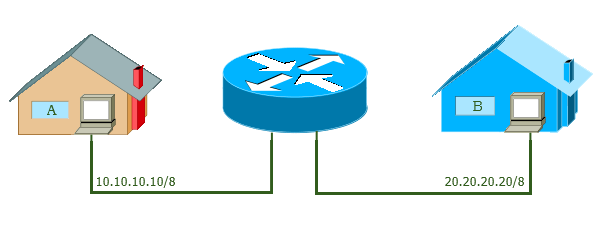  

Полный процесс маршрутизации IP-адресов основан на двух типах протоколов: маршрутизируемых протоколах и протоколах маршрутизации. Прежде чем мы поймем, как работает IP-маршрутизация, давайте разберемся в различиях между обоими типами протоколов.

Протоколы маршрутизации в/с Маршрутизация и протоколы маршрутизации
Маршрутизируемый протокол используется для инкапсуляции данных, которыми обмениваются исходный хост и конечный хост. В IP-маршрутизации протокол IP используется в качестве маршрутизируемого протокола.

Используя протокол IP, исходный хост упаковывает фрагменты данных и добавляет исходный адрес и адрес назначения на каждый фрагмент данных. Фрагмент данных с обоими адресами (исходным и конечным) называется IP-пакетом.

Любой маршрутизатор, работающий по пути, соединяющему исходный узел с конечным узлом, использует оба адреса (исходный и конечный), чтобы узнать, откуда пришел пакет и куда он пойдет.


**Протокол маршрутизации** 

Маршрутизаторы используют протокол маршрутизации для следующих целей.

* Чтобы выяснить все доступные пути сети. Маршрутизатор хранит эти пути в таблице, известной как таблица маршрутизации.

* Чтобы выбрать лучший и самый быстрый путь для получения конечного хоста. Когда маршрутизатор получает IP-пакет, он проверяет свою таблицу маршрутизации и сравнивает все доступные пути для получения целевой сети полученного IP-пакета и выбирает самый быстрый путь из всех доступных путей.

`RIP`, `IGRP`, `EIGRP` и `OSPF` являются примерами протоколов маршрутизации. 

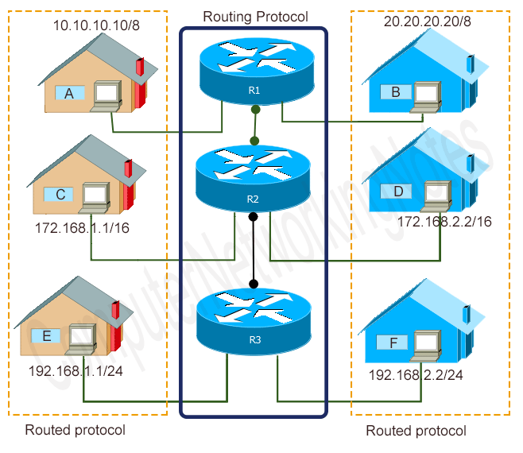 

Процесс IP-маршрутизации начинается, когда хост создает пакет данных для хоста, расположенного в другой сети, и заканчивается, когда этот конечный хост получает пакет. Чтобы понять этот процесс в деталях, давайте возьмем простой пример.

На следующем рисунке показана схема расположения сети. В этой сети `PC0` и `PC1` соединены с `PC2` через четыре маршрутизатора: `R1`, `R2`, `R3` и `R4`. 

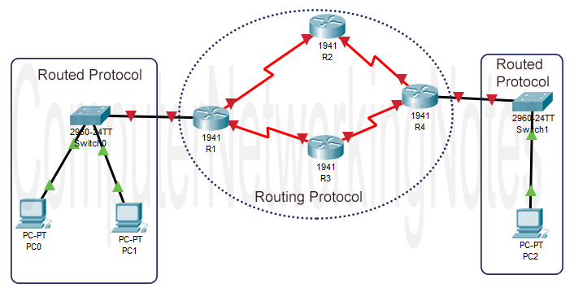 

Предположим, что приложение, работающее на `PC0`, хочет отправить некоторые данные на `ПК 1`. Приложение вызывает `IP-протокол PC0` и передает эти данные в IP-протокол. Протокол IP упаковывает данные в пакеты и добавляет к каждому пакету адреса источника и назначения.

После этого протокол IP использует другой протокол, известный как протокол ARP, чтобы выяснить, находится ли адрес назначения (`PC1`) в локальной сети (та же IP-сеть) или находится в удаленной сети (другая IP-сеть).

Если адрес назначения находится в той же IP-сети (локальной), протокол IP отправляет пакеты непосредственно на конечный узел.

Весь процесс маршрутизации контролируется маршрутизируемыми протоколами (IP) `PC0` и `PC1`.

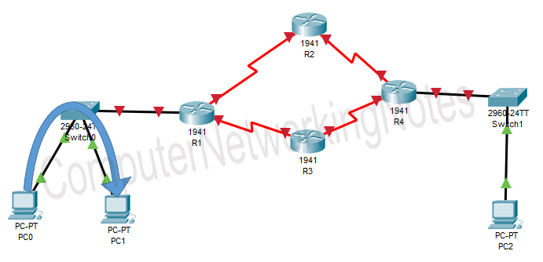

Теперь предположим, что одно и то же приложение хочет отправить данные на `PC2`. Тот же процесс повторяется до тех пор, пока решение о пересылке пакетов не будет принято протоколом IP. На этот раз, поскольку конечный хост (`PC2`) находится в удаленной сети (другой IP-сети), протокол IP отправляет пакеты на шлюз по умолчанию.

Шлюз по умолчанию - это интерфейс маршрутизатора, который соединяет локальную сеть с удаленной сетью. По умолчанию протокол IP пересылает все пакеты на шлюз по умолчанию, за исключением пакетов, принадлежащих локальной IP-сети.

Маршрутизатор шлюза по умолчанию не только хранит записи всех удаленных сетей, но и хранит записи всех доступных путей для каждой удаленной сети. Маршрутизатор сохраняет эти записи в таблице маршрутизации. Типичная запись таблицы маршрутизации состоит из двух частей: сетевого адреса и интерфейса, на котором эта сеть доступна.

Когда маршрутизатор получает пакет на любом из своих интерфейсов, он считывает целевую сеть этого пакета и находит эту сеть в таблице маршрутизации. Если таблица маршрутизации содержит запись для этой сети, маршрутизатор использует эту запись для пересылки пакета. Если таблица маршрутизации не содержит записи для этой сети, маршрутизатор отбрасывает этот пакет.

Если существует несколько путей к удаленной сети, маршрутизатор выбирает самый быстрый путь из них.

В нашем примере маршрутизатор шлюза `R1` по умолчанию имеет два пути для доступа к сети `PC2`. Когда он получает пакеты для `PC2` от `PC0`,он сравнивает оба пути и выбирает самый быстрый путь для пересылки пакетов. 

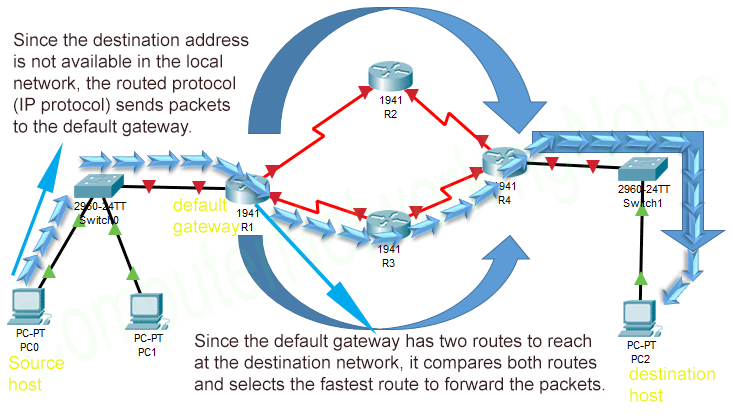

`PC2` получает пакеты от своего маршрутизатора шлюза R4 по умолчанию. Весь процесс маршрутизации управляется обоими типами протоколов: маршрутизируемыми и маршрутизируемыми протоколами.

Вот и все по этой части. В следующей части этого урока я объясню основные понятия протоколов маршрутизации. Если вам нравится этот учебник, пожалуйста, не забудьте поделиться им с друзьями через вашу любимую социальную сеть. 

[[открыть сайт источник]](https://www.computernetworkingnotes.com/ccna-study-guide/basic-of-ip-routing-explained-with-example.html) 

[[ВЕРНУТЬСЯ К СОДЕРЖАНИЮ]](#Contents) 


</br>
</br>


------------------------------------------------------------------------------------------
# Какой шлюз по умолчанию используется для маршрутизации ?  <a name="gateway"></a>


Шлюз по умолчанию - это маршрутизатор, который хосты используют для связи с другими хостами в удаленных сетях. Шлюз по умолчанию используется, когда хост не имеет записи маршрута для конкретной удаленной сети и не знает, как добраться до этой сети. Хосты могут быть настроены для отправки всех пакетов, предназначенных для удаленных сетей, на шлюз по умолчанию, который имеет маршрут для достижения этой сети.

В следующем примере более подробно объясняется концепция шлюза по умолчанию. 

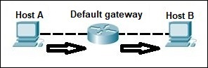 

Хост A имеет IP-адрес маршрутизатора `R1`, настроенный в качестве адреса шлюза по умолчанию. Хост A пытается связаться с хостом B, хостом в другой, удаленной сети. Хост а просматривает свою таблицу маршрутизации, чтобы проверить, есть ли запись для этой целевой сети. Если запись не найдена, хост отправляет все данные на маршрутизатор `R1`. Маршрутизатор `R1` принимает пакеты и пересылает их на хост B.

Таблица маршрутизации - каждый маршрутизатор поддерживает таблицу маршрутизации и хранит ее в оперативной памяти. Таблица маршрутизации используется маршрутизаторами для определения пути к целевой сети. Каждая таблица маршрутизации состоит из следующих записей:

Cетевое назначение и маска подсети - задает диапазон IP-адресов. 

Удаленный маршрутизатор – IP-адрес маршрутизатора, используемого для доступа к этой сети.

Исходящий интерфейс - исходящий интерфейс пакет должен выйти, чтобы достичь целевой сети.


Существует три различных способа заполнения таблицы маршрутизации:
* подсети с прямым подключением
* использование статической маршрутизации
* использование динамической маршрутизации


Рассмотрим следующий пример. `Хост A` хочет связаться с `хостом B`, но `хост B` находится в другой сети. Узел а настроен на отправку всех пакетов, предназначенных для удаленных сетей, на маршрутизатор. Маршрутизатор получает пакеты, проверяет таблицу маршрутизации, чтобы увидеть, есть ли в ней запись для адреса назначения. Если это происходит, маршрутизатор пересылает пакет через соответствующий интерфейсный порт. Если маршрутизатор не находит запись, он сбрасывает пакет.  

  

Мы можем использовать команду show ip route из включенного режима для отображения таблицы маршрутизации маршрутизатора.  

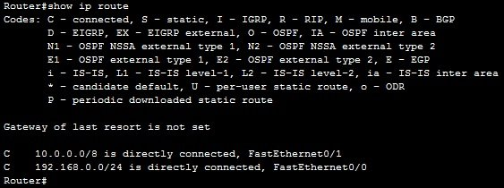  

Как вы можете видеть из выходных данных выше, этот маршрутизатор имеет два непосредственно подключенных маршрута к подсетям `10.0.0.0 / 8` и `192.168.0.0/24`. Символ `C` в таблице маршрутизации указывает, что маршрут является непосредственно связанным маршрутом. Таким образом, когда `хост A` отправляет пакет `хосту B`, маршрутизатор посмотрит в свою таблицу маршрутизации и найдет маршрут к сети `10.0.0.0/8`, в которой находится `хост B`. Затем маршрутизатор будет использовать этот маршрут для маршрутизации пакетов, полученных от `узла A` к `узлу B`.  

[[открыть сайт источник]](https://study-ccna.com/what-is-ip-routing/)  

[[ВЕРНУТЬСЯ К СОДЕРЖАНИЮ]](#Contents)  


</br>
</br>


------------------------------------------------------------------------------------------
# Что такое порт с точки зрения IP и для чего он используется при подключении к другому устройству ? <a name="device"></a>


---

Порт — целое неотрицательное число, записываемое в заголовках протоколов транспортного уровня `модели OSI` (`TCP`, `UDP`, `SCTP`, `DCCP`). Используется для определения процесса-получателя пакета в пределах одного хоста. 

Обычно на хосте под управлением ОС в пространстве пользователя исполняется несколько процессов, в каждом из которых выполняется какая-либо программа. В случае если несколько программ используют компьютерную сеть, то ОС периодически получает по сети IP-пакет, предназначенный для одной из программ.


Процесс программы, желающей обмениваться данными по сети, может (например, при создании `socket`(соединения)):

* Запросить у ОС в своё распоряжение порт с определённым номером. ОС может либо предоставить порт с этим номером, либо отказать программе (например, в случае, когда порт с этим номером уже отдан в распоряжение другому процессу);
* Запросить у ОС в своё распоряжение свободный порт с любым номером. ОС в этом случае сама выберет свободный порт, ещё не занятый никаким процессом, и предоставит его в распоряжение запрашивающей программе.


Обмен данными по сети ведётся между двумя процессами по определённому протоколу. Для установки соединения необходимы:
* Номер протокола;
* Два IP-адреса (адрес хоста-отправителя и адрес хоста-получателя для построения маршрута между ними);
* Два номера порта (порт процесса-отправителя и порт получателя).
Порт процесса-отправителя (источника) может быть постоянным (статическим) или назначаться динамически для каждого нового сеанса связи.


При соединении по протоколу TCP порт процесса-отправителя используется:
* Операционной системой хоста-получателя для отправки пакета-подтверждения о получении данных;
* Процессом-получателем для отправки пакета-ответа.


При соединении по протоколу UDP допустимо вместо порта процесса-отправителя указывать число ноль, означающее «порт не указан».


При соединении по протоколу SCTP в рамках ассоциации может использоваться:
* Несколько портов процесса-отправителя (источника)
* Несколько портов процесса-получателя.


Так как IP-адрес хоста-отправителя и номер порта процесса-отправителя являются аналогом обратного адреса, записываемого на почтовых конвертах (позволяют получателю отправить ответ отправителю), номер порта процесса-отправителя иногда называют «обратным» портом.

Если на хосте какой‑либо процесс постоянно использует один номер порта (например, процесс программы, реализующей web-сервер, может использовать `порт 80` для `приёма` и `передачи данных`), говорят, что порт является «открытым».

Термины «открытый порт» и «закрытый порт» (заблокированный) также используются, когда речь идёт о фильтрации сетевого трафика.

Если процесс получил номер порта у ОС («открыл порт») и «держит его открытым» для приёма и передачи данных, говорят, что процесс «прослушивает» (разг. `слушает`, от англ. `listen`) порт.

Обычно прослушиванием порта занимается процесс программы, реализующей сервер для какого-либо протокола. Процесс программы, реализующей клиент для того же протокола, часто позволяет ОС указать номер порта для подключения к серверу.

Если хост получит пакет, порт процесса-отправителя называется «удалённым» (англ. remote) портом или "открытым на другом хосте", а порт процесса получателя — «локальным» портом, то есть открытым на текущем хосте. Если хост отправил пакет, порт процесса-отправителя называется «локальным» портом (открытым на текущем хосте), а порт процесса-получателя — «удалённым» портом (открытым на другом хосте).

Номера портов для протоколов прикладного уровня модели `TCP/IP` (`HTTP`, `SSH` и др.) обычно назначаются организацией `IANA` (англ. `internet assigned numbers authority`). Однако на практике в целях безопасности номера портов могут выбираться произвольно.

Термин «порт» чаще всего применяется по отношению к протоколам `TCP` и `UDP` ввиду популярности этих протоколов. В протоколах `SCTP` и `DCCP` используются номера, соответствующие понятию «номер порта» для протоколов `TCP` и `UDP`.

В заголовках протоколов `TCP` и `UDP` для хранения номеров портов выделены поля размером 16 бит. Для протокола `TCP` порт с номером 0 зарезервирован и не может использоваться. Для протокола `UDP` указание порта процесса-отправителя («обратного» порта) не является обязательным, и порт с номером 0 означает отсутствие порта. Таким образом, номер порта — число в диапазоне от `1` до `2^16-1=65 535`.  

[[открыть сайт источник]](https://ru.wikipedia.org/wiki/Порт_(компьютерные_сети))  

[[ВЕРНУТЬСЯ К СОДЕРЖАНИЮ]](#Contents)  


</br>
</br>


------------------------------------------------------------------------------------------
# Таблица различий между TCP и UDP <a name="table"></a>


| TCP | UDP |
|:---:|:---:|
| TCP - это протокол, ориентированный на соединение. Ориентация на соединение означает, что устройства связи должны установить соединение до передачи данных и закрыть соединение после передачи данных. | UDP - это протокол, ориентированный на датаграммы. Это происходит потому, что нет никаких накладных расходов на открытие соединения, поддержание соединения и завершение соединения. UDP эффективен для широковещательного и многоадресного типа передачи данных по сети. |
| TCP надежен, так как он гарантирует доставку данных к целевому маршрутизатору. | Доставка данных в пункт назначения не может быть гарантирована в UDP. |
| TCP предоставляет обширные механизмы проверки ошибок. Это происходит потому, что он обеспечивает управление потоком и подтверждение данных. | UDP имеет только основной механизм проверки ошибок с использованием контрольных сумм. |
| Секвенирование данных является особенностью протокола управления передачей (TCP). это означает, что пакеты поступают в приемник по порядку. | В UDP нет никакой последовательности данных. Если требуется упорядочение, то оно должно управляться прикладным уровнем. |
| TCP работает сравнительно медленнее, чем UDP. | UDP работает быстрее, проще и эффективнее, чем TCP. |
| Повторная передача потерянных пакетов возможна в TCP, но не в UDP. | В протоколе пользовательских дейтаграмм (UDP) отсутствует повторная передача потерянных пакетов. |
| TCP имеет заголовок переменной длины (20-80) байт. | UDP имеет заголовок фиксированной длины 8 байт. |
| TCP - это тяжелый груз. | UDP-это легкий вес. |
| TCP не поддерживает широковещательную передачу. | UDP поддерживает вещание. |
| TCP используется HTTP, HTTPs, FTP, SMTP и Telnet. | Протокол UDP используется DNS, сервер DHCP, сервер TFTP, SNMP, RIP, и VoIP. |
  
[[ВЕРНУТЬСЯ К СОДЕРЖАНИЮ]](#Contents)  


---

**Author by:** *[Mark Veligod](https://github.com/markveligod)*  
**Edited:** *[evgenkarlson](https://github.com/evgenkarlson)*  
