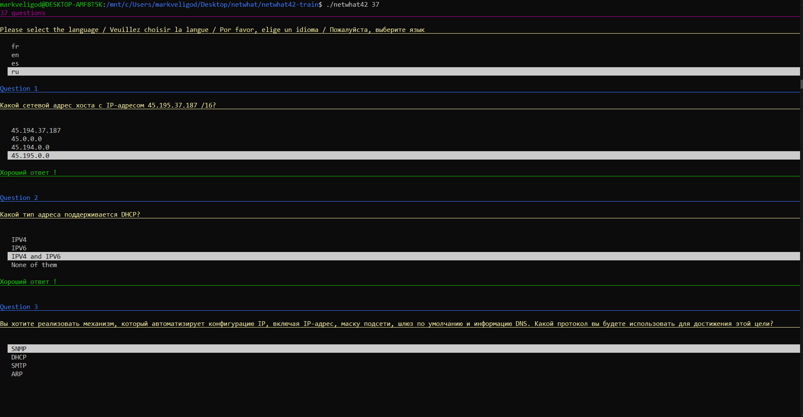

# ТРЕНИРОВОЧНЫЕ ТЕСТЫ ПО NETWHAT <a name="test"></a>
### Описание  
Данные тесты позволят потренироваться перед реальным тестированием на сайте netwhat.42.fr. Для запуска тестов `offline` откройте в терминале деррикторию `test_netwhat` и запустите тренировку написав команду `./netwhat42 37` 

Ссылка на тест: [click](https://github.com/adblanc/netwhat42-train) 


 


</br>
</br>

---
# Руководство по викторине netwhat #

---
> Полезные ссылки:
>
> - [Подробно и понятно про сети](https://www.asozykin.ru/courses/networks_online)
> - [IP Калькулятор подсетей](http://infocisco.ru/ip_calculator.php)
> - [Лекция CS](https://www.youtube.com/watch?v=BJSITWkSDQg&t=71s&ab_channel=IndustrialSoftwareEngineeringOnline)
---

Что из предложенных является допустимым диапазоном хостов для подсети, в которой находится `IP-адрес` `158.167.18.156/15`:


* 158.166.0.1 - 158.167.255.253
* 158.165.255.253 - 158.167.255.254
* `158.166.0.1 - 158.167.255.254`
* 158.166.0.2 - 158.168.0.2


```
 --------------------------------------
| Пример:                              |
 ---------------------------------------
| IP адрес: 158.167.18.156             |
|                                      |
| Маска подсети: 255.254.0.0 = 15      |
|                                      |
| Адрес сети: 158.166.0.0 / 15         |
|                                      |
|  ----------------------------------  |
| | Минимальный IP: 158.166.0.1      | |
| |                                  | |
| | Максимальный IP: 158.167.255.254 | |
|  ----------------------------------  |
|                                      |
| Broadcast: 158.167.255.255           |
|                                      |
| Число хостов: 131,070                |
 --------------------------------------
```


---


Если `IP-адрес` `123.48.189.194/21` назначен порту `Ethernet` маршрутизатора, то какой адрес `хоста` может с ним взаимодействовать:


* 101.219.223.235
* 75.153.38.143
* 5.200.165.154
* 13.28.168.153
* 172.1.223.196
* 43.241.96.42
* `123.48.189.109`
* 253.99.227.186


---


Что из предложенных является частным `IP-адресом`:


* 57.195.242.245
* `172.27.217.52`
* 249.204.256.26
* 249.204.156.26
* 4.137.228.63
* 176.37.230.43
* 218.106.207.158


---


Укажите сетевой адрес хоста с `IP-адресом` `182.161.121.118/24`:


* 180.0.0.0
* 182.161.121.64
* 182.161.120.0
* 182.161.121.116
* 0.0.0.0
* 182.161.96.0
* 182.160.0.0
* `182.161.121.0`


---


Какое максимальное количество `IP-адресов` может быть назначено хостам в локальной подсети с помощью маски подсети `255.255.128.0`:

```
 --------------------------------------
| Пример:                              |
 ---------------------------------------
| IP адрес: 192.168.0.0                |
|                                      |
| ------------------------------------ |
|| Маска подсети: 255.255.128.0 = 17 | |
| ------------------------------------ |
|                                      |
| Адрес сети: 192.168.0.0 / 17         |
|                                      |
| Минимальный IP: 192.168.0.1          |
|                                      |
| Максимальный IP: 192.168.127.254     |
|                                      |
| Broadcast: 192.168.127.254           |
|                                      |
|  ----------------------------------  |
| | Число хостов: 32,766 Class C     | |
|  ----------------------------------  |
 --------------------------------------
 ```

* 65536
* 65532
* 16380
* 32768
* 32770
* 65530
* `32766`
* 16382
* 32764


---


Вы хотите реализовать механизм, который автоматизирует `IP` конфигурацию, включая `IP адрес`, маску подсети, основной шлюз и информацию `DNS`. Какой протокол вы будете использовать для этого:

* SNMP
* `DHCP`
* SMTP
* ARP


---


У вас есть интерфейс на маршрутизаторе с `IP-адресом` `124.144.156.248/21`. Сколько хостов могут иметь `IP-адреса` в локальной сети, подключенной к интерфейсу маршрутизатора, включая интерфейс маршрутизатора:


* 1020
* 2050
* 2044
* 4090
* `2046`
* 2048
* 4092
* 2042
* 4094


---


Что из предложенных является допустимым диапазоном хостов для подсети, в которой находится `IP-адрес` `1.93.149.6/17`:


* 1.93.127.255- 1.93.255.250
* 1.93.128.1 - 1.94.0.1
* 1.93.128.1 - 1.93.255.251
* `1.93.128.1 - 1.93.255.254`
* 1.93.128.1 - 1.94.0.3


---


Какой сетевой адрес хоста с `IP-адресом` `107.212.146.212.212/25`:


* 107.212.146.208
* 107.128.0.0
* 0.0.0.0
* 64.0.0.0
* 107.212.128.0
* `107.212.146.128`
* 107.212.0.0
* 107.208.0.0
* 107.212.146.192


---


Что из предложенных является допустимым диапазоном хостов для подсети, в которой находится `IP-адрес` `233.249.146.36/21`:


* 233.249.143.255 - 233.249.151.250
* 233.249.144.4 - 233.249.152.0
* `233.249.144.1 - 233.249.151.254`
* 233.249.144.6 - 233.249.152.1
* 233.249.144.0 - 233.249.151.249


---

Какое из предложенных утверждений не соответствует правде:


* `TCP — протокол, ориентированный на датаграммы`
* ТСР не поддерживает вещание
* TCP предоставляет расширенные механизмы проверки ошибок. Это связано с тем, что он обеспечивает управление потоком и квитирование данных.
* Последовательность данных — это TCP-функция (это означает, что пакеты поступают по порядку в получателе).
* TCP является надежным, так как гарантирует доставку данных на маршрутизатор получателя.
* TCP сравнительно медленнее, чем UDP.


---

Какой сетевой адрес хоста с `IP-адресом` `166.175.144.121/23`:

* 166.128.0.0
* `166.175.144.0`
* 166.175.144.96
* 128.0.0.0
* 166.174.0.0
* 166.0.0.0
* 166.0.0.0
* 166.175.144.120


---


Какое максимальное количество `IP-адресов` может быть назначено хостам в локальной подсети с помощью маски подсети `255.255.255.255.128`:

* 128
* 60
* `126`
* 62
* 252
* 258
* 124
* 58
* 64


---


Какое максимальное количество `IP-адресов` может быть назначено хостам в локальной подсети с помощью маски подсети `255.224.0.0`:


* 4194306
* 4194302
* 1048578
* 4194300
* 2097148
* 4194298
* 1048574
* `2097150`
* 1048576


---


Что из предложенных является частным `IP-адресом`:

* `10.182.204.132`
* 116.124.85.24
* 52.178.248.246
* 186.183.40.79


---


Какой протокол `DHCP` используется на транспортном уровне:

* ICMP
* TCP
* FTP
* `UDP`


---


У вас есть интерфейс на маршрутизаторе с `IP-адресом` `240.19.3.205/12`. Сколько хостов может иметь `IP-адреса` в локальной сети, подключенной к интерфейсу маршрутизатора, включая интерфейс маршрутизатора:

* 1048576
* 2097154
* `1048574`
* 524284
* 1048578
* 2097148
* 1048572


---


Какой широковещательный адрес узла с `IP-адресом` `51.254.122.100/24`:

* 51.254.122.0
* 51.254.122.1
* 51.254.122.254
* `51.254.122.255`


---


Что является CIDR записью (бесклассовой адресации) маски подсети `255.255.128.0`:

* /8
* /16
* /9
* `/17`


---


Что является `CIDR` записью (бесклассовой адресации) маски подсети `255.255.192.0`?

* /5
* /31
* `/18`
* /14


---


Какие уровни содержит модель `OSI`:

* `Application - Presentation - Session - Transport - Network - Data Link - Physical`
* Application - Mediation - Session - Transport - Network - Data Link - Physical
* Presentation - Session - Transport - Network - Data Link - Application - Real
* Relation - Transport - Session - Data Link - Mediation - Presentation - Application


---


Какой сетевой адрес хоста с `IP-адресом` `116.45.224.50/8`:

* 116.0.1.0
* `116.0.0.0`
* 116.255.255.0
* 116.255.255.255


---


Какой сетевой адрес хоста с `IP-адресом` `45.195.37.187/16`:


* 45.194.37.187
* 45.0.0.0
* 45.194.0.0
* `45.195.0.0`


---


Что транслирует доменные имена в Интернете и имена хостов в IP-адреса:

* Network time protocol
* Default routing protocol
* `Domain name system`
* OSI model system


---


У какого класса IP-адресов по умолчанию доступно больше адресов хоста:

> Таблица ниже может "поехать" на маленьком экране.
```
 --------------------------------------------------------------- 
|       |        | Распределение байт |   Число    |   Число    |
| Класс | Первые |      С - сеть      | возмождных | возможных  |
|       |  Биты  |      Х - хост      |   сетей    |   хостов   |
|-------|--------|--------------------|------------|------------|
|   A   |  0     |       С.Х.Х.Х      |     126    | 16 777 214 |
|-------|--------|--------------------|------------|------------|
|   B   |  10    |       С.С.Х.Х      |   16 384   |   65 534   |
|-------|--------|--------------------|------------|------------|
|   C   |  110   |       С.С.С.Х      | 2 097 152  |     254    |
|-------|--------|----------------------------------------------|
|   D   |  1110  |             Групповой адресс                 |
|-------|--------|----------------------------------------------|
|   E   |  1111  |              Зарезервировано                 |
 --------------------------------------------------------------- 
```

* C
* D
* E
* F
* `FIRST`


---


Какое из предложенных утверждений не соответствует правде:

* UDP быстрее, проще и эффективнее, чем TCP.
* UDP имеет только основной механизм контроля ошибок
* UDP - протокол, ориентированный на датаграммы
* `UDP не поддерживает вещание`


---


Какое из предложенных утверждений не соответствует правде:

* TCP является протоколом, ориентированным на соединения
* TCP не поддерживает вещание
* TCP предоставляет расширенные механизмы проверки ошибок. Это связано с тем, что он обеспечивает управление потоком и квитирование данных.
* Последовательность данных - это функция TCP (это означает, что пакеты поступают по порядку в получателе).
* `Доставка данных в пункт назначения не может быть гарантирована в TCP`
* TCP является надежным, так как гарантирует доставку данных на маршрутизатор получателя.


---


Какой класс `IP-адресов` по умолчанию доступен:

* A AND B
* FIRST
* `C`
* B


---


Какая маска подсети `/24`:

* 255.255.255.255
* `255.255.255.0`
* 255.0.0.0
* 255.255.128.0
* 255.192.0.0
* 255.224.0.0


---


Какой из следующих `IP-адресов` является частным адресом:

* 169.153.119.123
* 24.23.102.151
* 255.62.136.173
* `10.166.25.20`
* 46.244.138.171
* 27.147.158.251


---


Какой из следующих `IP-адресов` является частным адресом:

* 222.9.230.144
* 135.167.134.35
* 172.32.0.5
* 27.157.141.96
* `172.16.0.2`
* 129.244.78.149
* 137.223.167.235


---


Какой из следующих `IP-адресов` является частным адресом:

* 108.246.233.231
* 146.227.105.173
* 59.155.254.18
* 253.29.133.220
* `192.168.20.253`
* 94.152.104.99


---


Какой размер адреса `IPV4`:

* 128 бит
* `32 бит (4 октета по 8 бит)`
* 64 мили
* 16 бит
* 8 бит
* 64 байт
* 128 байт


---


Каков размер адреса `IPV6`:

* `128 бит (восемь шестнадцатеричных чисел)`
* 32 бит
* 64 мили
* 16 бит
* 8 бит
* 64 байт
* 128 байт


---


Какой тип адреса поддерживается `DHCP`:

* IPV4
* IPV6
* `IPV4 and IPV6`
* None of them


---


Какой протокол использует `Ping`:


* ARP
* BootP
* TCP
* `ICMP`


---


Какое из предложенных утверждений не соответствует правде:

* UDP быстрее, проще и эффективнее, чем TCP.
* `UDP предоставляет расширенные механизмы проверки ошибок. Это связано с тем, что она обеспечивает управление потоком и квитирование данных.`
* UDP - протокол, ориентированный на датаграммы
* UDP поддерживает вещание


---


Какой `IP адрес` вы будете пинговать для проверки `IP стека` на вашем локальном хосте:

* 127.0.0.0
* 1.0.0.127
* `127.0.0.1`
* 255.255.255.0


