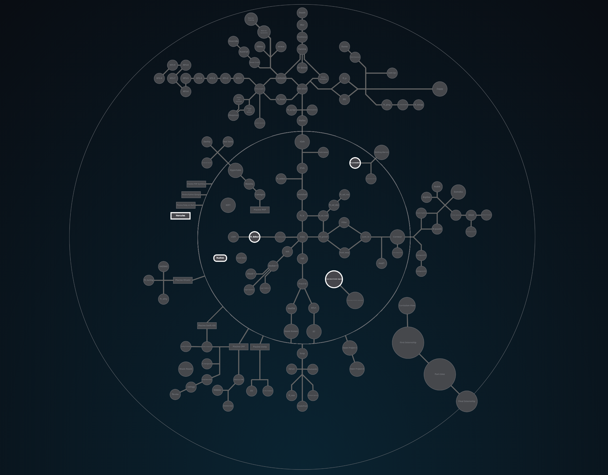

# Intermediate Exam 42

 КАРТА ПРОЕКТОВ 

---------------------------------------

Промежуточный экзамен по структуре похож на начальный экзамен, но он знакомит с динамическим программированием, требованиями к оптимизации и реализацией структур данных.

Охватываемые темы включают нотацию Big O, обход бинарных деревьев, многосвязные списки и математику строк. Некоторые проблемы требуют решения, выполняемого с определенной временной сложностью.

---------------------------------------
typedef 
https://overiq.com/c-programming-101/typedef-statement-in-c/ 
Syntax: typedef data_type new_name;

convert_bst
Convert a Binary Tree to a Circular Doubly Link List: 
https://www.geeksforgeeks.org/convert-a-binary-tree-to-a-circular-doubly-link-list/
