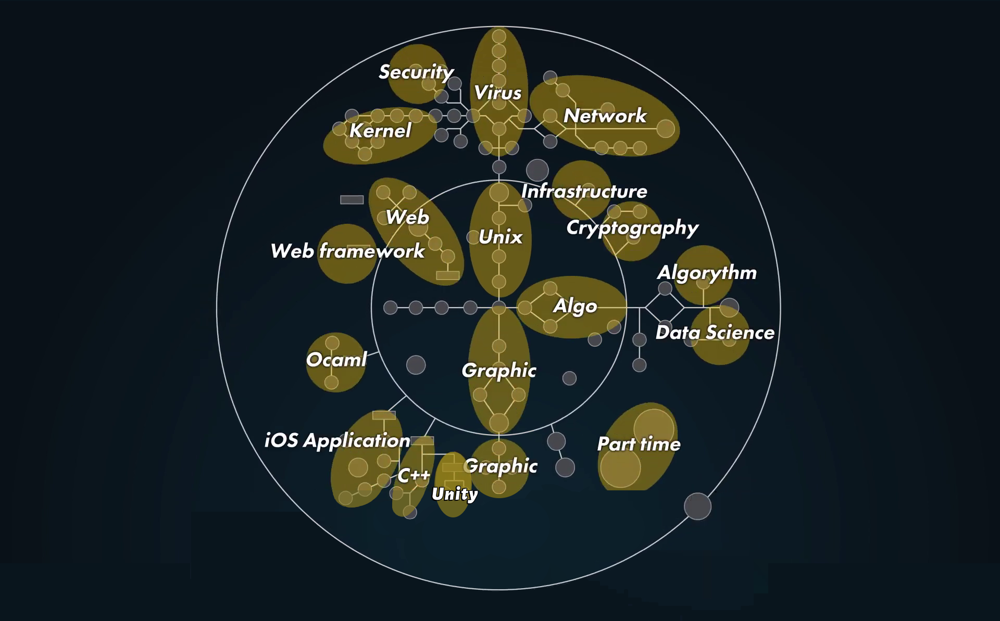

# Задания основного обучения Школы 42 #

> Для продвижения по заданиям Основного обучения Школы 42 используйте карту заданий [[Holy Graph]](./Holy_Graph.png)

 ### [GLOBAL - Общая ветвь]
 - 42_commandements
 - piscine reloaded
 - libft
 - ft_debut
 - get_next_Line
 - fillit

 ### [[Ветвь UNIX]](./01_Unix/)
 - ft_ls
 - minishell
   - ft_select (Optional Project)
 - 21sh
   - Taskmaster (Optional Project)
 - 42sh
 - Malloc
   - ft_script
   - Philosophers
 - Nm-otool
   - ft_p
   - IRC
     - ft_ping
     - ft_traceroute
     - ft_nmap
     - Zappy
     - Lem-ipc
     - Matt Daemon
     - Durex
   - LibftASM
     - Root-me | App-Systeme
     - Root-me | Cracking
     - Snow Crash
     - RainFall
     - strace
     - GBmu
   - little-penguin-1
     - Process and Memory 
     - Drivers and Interrupts -=OR=- Drivers and Keyboard
     - Filesystem
   - Woody Woodpacker
     - Famine
     - Dr Quine
   - ft_linux
     - KFS-1
     - KFS-2
     - KFS-3
     - KFS-4

 ### [[Ветвь Алгоритмов]](./02_Algorithmic/)
 - Ft_printf
   - ft_ssl_md5
   - ft_ssl_des
   - ft_ssl_rsa
 - Push_swap
 - Filler
 - Lem_in
   - Mod1 (Optional Project)
 - Corewar
   - Corewar Championship (Optional Project)
 - ComputorV1
   - ComputorV2
 - Expert System
 - N-puzzle
 - Ft_linear_regression
   - DSLR
   - Multilayer_perceptron
   - Total_perspective_vortex
 - Rubik
 - KrpSim
 - Gomoku

 ### [[Ветвь Графики]](./03_Graphic/)
 - FDF
 - Fract'Ol
 - Wolf3D
 - RTv1
 - Doom Nukem
 - RT
 - Scop
 - 42run
 - HumanGL
 - ft_vox
 - Particle System
 - Shader Pixel

 ### [[WEB ветвь]](./04_Web/)
 - piscine PHP
 - Camagru
 - Matcha
 - Hypertube
 - Friends with Benefits
 - Red Tetris
 - Darkly

 ### [[OCaml ветвь]](./09_OCaml/)
 - piscine Ocaml
 - ft_ality
 - ft_turing
 - H42N42

 ### [[Android & iOS ветвь]](./06_Android-iOS/)
 - piscine Swift iOS
 - Swifty Companion
 - Swifty Proteins
 - ft_hangouts
 - avaj-launcher
 - swingy
 - fixme

 ### [[C++ ветвь]](./07_CPP/)
 - piscine C++
 - Abstract VM
 - Nibbler
 - Bomberman

 ### [[Unity ветвь]](./08_Unity/)
 - piscine Unity
 - XV
 - In the Shadows

 ### [[Системное & Сетевое Администрирование]](./05_Network_Admin/)
 - init
 - docker-1
 - cloud-1
 - roger-skyline-1
 - roger-skyline-2

 ### [[Ai Projects - Искуственный интелект]](./10_Ai/)
 - walking_marvin
 - ft_sommelier
 - reverse_game_of_life

 ### [[Side Projects - Сторонние Проекты]](./12_Side_Projects/)
 - ft_db
 - KIFT

