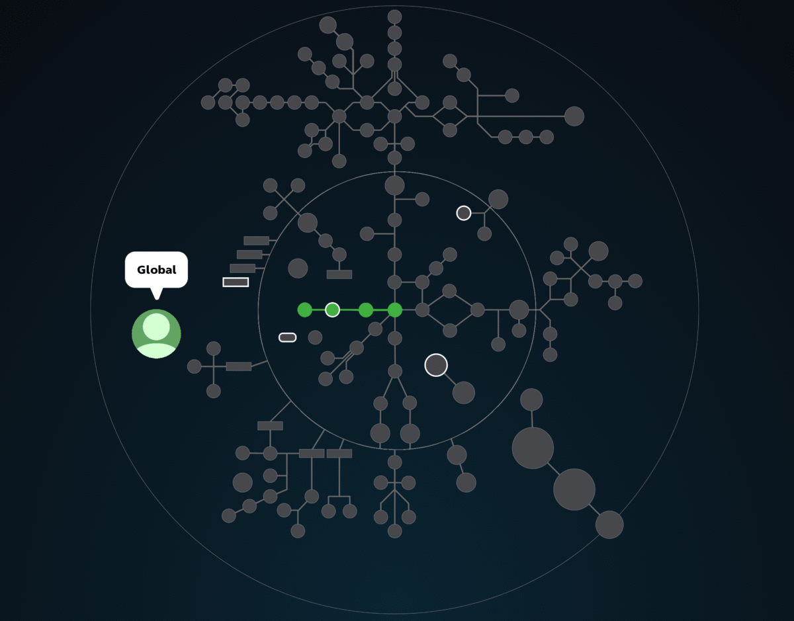

# ПРОЕКТЫ И ЗАДАНИЯ ОСНОВНОГО КУРСА ОБУЧЕНИЯ ШКОЛЫ 42

---

 КАРТА ПРОЕКТОВ 

---

Проекты основного курса обучения представляют собой следующий этап обучения программированию. Все они сгруппированы по направлениям, которые представлены в виде ветвей. Помните, что каждый последующий проект выбранной вами ветки сложнее предыдущего и может быть решен только с помощью навыков полученных в предыдущих проектах.  

---
> ### [[GLOBAL - Общая ветвь]](https://github.com/evgenkarlson/Subjects___School_42/tree/master/00_Projects__(%D0%9E%D1%81%D0%BD%D0%BE%D0%B2%D0%BD%D0%BE%D0%B5_%D0%9E%D0%B1%D1%83%D1%87%D0%B5%D0%BD%D0%B8%D0%B5)/00_Global_(begin_cadet)/)
---
>> #### С этой ветки начинается основное обучение.
> - 42_commandements
> - ft_debut
> - piscine reloaded
> - libft
> - netwhat
> - get_next_Line
> - fillit
---

> ### [[Ветвь UNIX]](https://github.com/evgenkarlson/Subjects___School_42/tree/master/00_Projects__(%D0%9E%D1%81%D0%BD%D0%BE%D0%B2%D0%BD%D0%BE%D0%B5_%D0%9E%D0%B1%D1%83%D1%87%D0%B5%D0%BD%D0%B8%D0%B5)/01_Unix/)
---
>> #### Эта ветвь содержит в себе несколько направлений: Unix, Kernel, Virus, Security, Network.
> - ft_ls
> - minishell
>   - ft_select
> - 21sh
>   - Taskmaster
> - 42sh
> - Malloc
>   - ft_script
>   - Philosophers
> - Nm-otool
>   - ft_p
>   - IRC
>     - ft_ping
>     - ft_traceroute
>     - ft_nmap
>     - Zappy
>     - Lem-ipc
>     - Matt Daemon
>     - Durex
>   - LibftASM
>     - boot2root
>     - Snow Crash
>       - RainFall
>       - Override
>     - GBmu
>     - strace
>       - Root-me | App-Systeme
>       - Root-me | Cracking
>   - Woody Woodpacker
>     - Dr Quine
>     - Famine
>     - Pestilence
>     - War
>     - Death
>   - little-penguin-1
>     - userspace digressions
>     - Process and Memory 
>     - Drivers and Interrupts -=OR=- Drivers and Keyboard
>     - Filesystem
>   - ft_linux
>     - KFS-1
>     - KFS-2
>     - KFS-3
>     - KFS-4
>     - KFS-5
>     - KFS-6
>     - KFS-7
>     - KFS-8
>     - KFS-9
>     - KFS-X
---

> ### [[Ветвь Алгоритмов]](https://github.com/evgenkarlson/Subjects___School_42/tree/master/00_Projects__(%D0%9E%D1%81%D0%BD%D0%BE%D0%B2%D0%BD%D0%BE%D0%B5_%D0%9E%D0%B1%D1%83%D1%87%D0%B5%D0%BD%D0%B8%D0%B5)/02_Algorithmic/)
---
>> #### Эта ветвь содержит в себе несколько  направлений: Algorithms, Data Science, Cryptography.
> - ft_printf
>   - ft_ssl_md5
>   - ft_ssl_des
>   - ft_ssl_rsa
> - Push_swap
> - Filler
> - Lem_in
>   - Mod1
> - Corewar
>   - Corewar Championship
> - ComputorV1
>   - ComputorV2
> - Expert System
> - N-puzzle
> - ft_linear_regression
>   - DSLR
>   - Multilayer_perceptron
>   - Total_perspective_vortex
> - Rubik
> - KrpSim
> - Gomoku
---

> ### [[Ветвь Графики]](https://github.com/evgenkarlson/Subjects___School_42/tree/master/00_Projects__(%D0%9E%D1%81%D0%BD%D0%BE%D0%B2%D0%BD%D0%BE%D0%B5_%D0%9E%D0%B1%D1%83%D1%87%D0%B5%D0%BD%D0%B8%D0%B5)/03_Graphic/)
---
> - FDF
> - Fract'Ol
> - Wolf3D (cub3d)
> - RTv1 (miniRT)
> - Doom Nukem
> - RT
> - Scop
> - 42run
> - HumanGL
> - ft_vox
> - Particle System
> - Shader Pixel
---

> ### [[WEB ветвь]](https://github.com/evgenkarlson/Subjects___School_42/tree/master/00_Projects__(%D0%9E%D1%81%D0%BD%D0%BE%D0%B2%D0%BD%D0%BE%D0%B5_%D0%9E%D0%B1%D1%83%D1%87%D0%B5%D0%BD%D0%B8%D0%B5)/04_Web/)
---
> - piscine PHP
> - Camagru
> - Matcha
> - Hypertube
> - Friends with Benefits
> - Red Tetris
> - Darkly
> - ft_transcendence
---

> ### [[Системное & Сетевое Администрирование]](https://github.com/evgenkarlson/Subjects___School_42/tree/master/00_Projects__(%D0%9E%D1%81%D0%BD%D0%BE%D0%B2%D0%BD%D0%BE%D0%B5_%D0%9E%D0%B1%D1%83%D1%87%D0%B5%D0%BD%D0%B8%D0%B5)//05_Infrastructure_and_Admin/)
---
> - init
> - docker-1
> - cloud-1
> - roger-skyline-1
> - roger-skyline-2
> - ft_server
> - ft_services
---

> ### [[Android & iOS ветвь]](https://github.com/evgenkarlson/Subjects___School_42/tree/master/00_Projects__(%D0%9E%D1%81%D0%BD%D0%BE%D0%B2%D0%BD%D0%BE%D0%B5_%D0%9E%D0%B1%D1%83%D1%87%D0%B5%D0%BD%D0%B8%D0%B5)/06_Android-iOS/)
---
> - piscine Swift iOS
> - Swifty Companion
> - Swifty Proteins
> - ft_hangouts
> - avaj-launcher
> - swingy
> - fixme
> - Music Room
---

> ### [[C++ ветвь]](https://github.com/evgenkarlson/Subjects___School_42/tree/master/00_Projects__(%D0%9E%D1%81%D0%BD%D0%BE%D0%B2%D0%BD%D0%BE%D0%B5_%D0%9E%D0%B1%D1%83%D1%87%D0%B5%D0%BD%D0%B8%D0%B5)/07_CPP/)
---
> - modules С++ (это то же самое, что и `piscine C++`, но новая версия)
> - piscine C++ (это то же самое, что и `modules С++` но старая версия)
> - webserv
> - ft_irc
> - ft_containers
> - Abstract VM
> - Nibbler
> - Bomberman
---

> ### [[Unity ветвь]](https://github.com/evgenkarlson/Subjects___School_42/tree/master/00_Projects__(%D0%9E%D1%81%D0%BD%D0%BE%D0%B2%D0%BD%D0%BE%D0%B5_%D0%9E%D0%B1%D1%83%D1%87%D0%B5%D0%BD%D0%B8%D0%B5)/08_Unity/)
---
> - piscine Unity
> - XV
> - In the Shadows
---

> ### [[OCaml ветвь]](https://github.com/evgenkarlson/Subjects___School_42/tree/master/00_Projects__(%D0%9E%D1%81%D0%BD%D0%BE%D0%B2%D0%BD%D0%BE%D0%B5_%D0%9E%D0%B1%D1%83%D1%87%D0%B5%D0%BD%D0%B8%D0%B5)/09_OCaml/)
---
> - piscine Ocaml
> - ft_ality
> - ft_turing
> - H42N42
---

> ### [[Ai Projects - Искуственный интелект]](https://github.com/evgenkarlson/Subjects___School_42/tree/master/00_Projects__(%D0%9E%D1%81%D0%BD%D0%BE%D0%B2%D0%BD%D0%BE%D0%B5_%D0%9E%D0%B1%D1%83%D1%87%D0%B5%D0%BD%D0%B8%D0%B5)/10_Ai/)
---
> - walking_marvin
> - ft_sommelier
> - reverse_game_of_life
---

> ### [[Side Projects - Сторонние Проекты]](https://github.com/evgenkarlson/Subjects___School_42/tree/master/00_Projects__(%D0%9E%D1%81%D0%BD%D0%BE%D0%B2%D0%BD%D0%BE%D0%B5_%D0%9E%D0%B1%D1%83%D1%87%D0%B5%D0%BD%D0%B8%D0%B5)/11_Side_Projects/)
---
> - ft_db
> - KIFT
---
