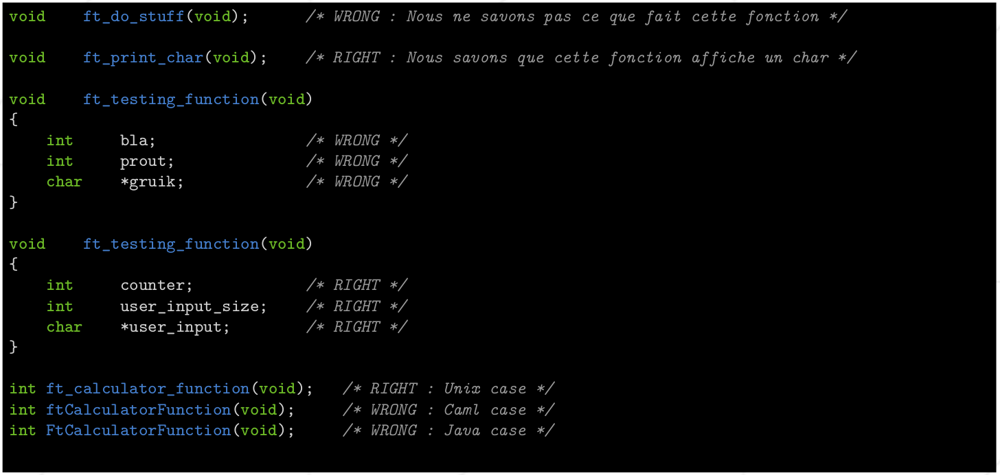
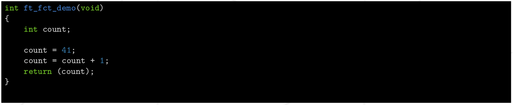
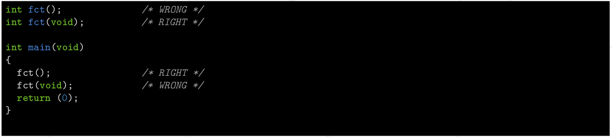
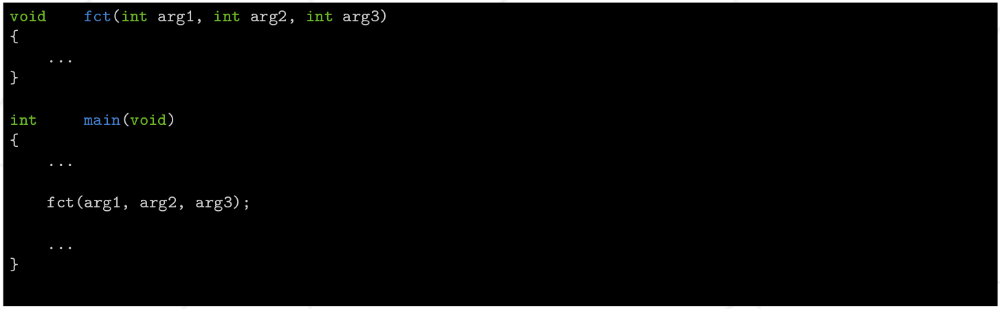
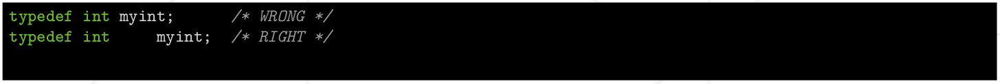
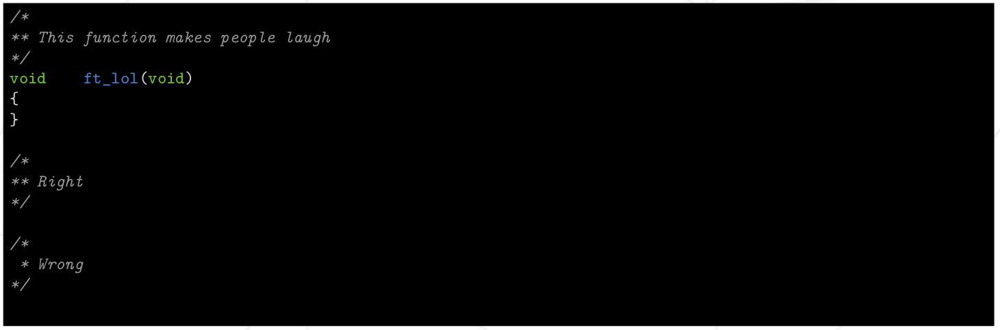

# Стандарт 42 #

### Версия 1.8 ###

#### Benny benny@42.fr ####

#### Thor thor@42.fr ####

#### marvin marvin@42.fr ####

#### Резюме: этом документе описан действующий стандарт по Си. Стандарт программирование определяет набор правил, регулирующих написание кода. Стандарт обязателен. Соблюдайте его при написании кода на Cи. ####

## Содержание ## 

I       [Предисловие](#предисловие)

- I.1    [Зачем навязывать стандарт?](#i1-зачем-навязывать-норму-)
- I.2    [Стандарт в ваших визуализациях](#i2-стандарт-в-ваших-визуализациях)
- I.3    [Совет](#i3-cовет)

II.1   [Норма 42](#стандарт-42-1)

- II.1    [Соглашение об именах](#ii1-соглашение-об-именах)
- II.2    [Форматирование](#ii2-форматирование)
- II.3    [Параметры функции](#ii3-параметры-функций)
- II.4    [Функции](#ii4--функции)
- II.5    [Typedef, struct, enum и union](#ii5определение-типа-struct-enum-или-unionструктуры-перечисления-или-объединения)
- II.6    [Заголовки](#ii6заголовки)
- II.7    [Макросы и препроцессор](#ii7-макросы-и-препроцессор)
- II.8    [Запрещенные вещи!](#ii8-запрещенные-вещи)
- II.9    [Комментарии](#ii9-комментарии)
- II.10   [Файлы](#ii10файлы)
- II.11   [Makefile](#ii11makefile)

III.      [Норминетта(La Norminette)]((#глава-iii))

# Глава I # 

### Предисловие ### 

В этом документе описан действующий стандарт по Си. Стандарт программирование определяет набор правил, регулирующих написание кода. Стандарт обязателен. Соблюдайте его при написании кода на Cи.

### I.1 Зачем навязывать норму ? ###

Стандарт имеет две основные цели:
* Стандартизируйте свои коды, чтобы каждый мог легко их прочитать, студенты и контролеры.
* Пишите простые и понятные коды.

### I.2 Стандарт в ваших визуализациях ###

* Все ваши файлы с кодом C должны соответствовать `стандарту 42`. Стандарт будет проверен вашими корректорами и даже малейшая ошибка в стандарте даст оценку 0 вашему проекту или вашему упражнению.

* Корректирующая утилита, используемая в дополнение к вашей защите задания, запустит программу под названием `Norminette`. `Norminette` проверит подмножество стандартных правил, которые он может проверить.

* Следует учитывать что только результат `Norminette` должен быть принят во внимание. Таким образом, все будут равны перед лицом стандарта. Вы найдете список стандартных правил, которыми `Norminette` управляет в данный момент в конце этого документа. Этот список будет регулярно обновляться, так что следите за этим.

### I.3 Cовет ###

* Как вы быстро поймете, стандарт не является ограничением. Напротив, стандарт является гарантией, которая поможет вам в написании простого и базового кода на `Cи`. Вот почему абсолютно необходимо, чтобы вы кодировали непосредственно по стандарту, пусть и кодируя медленнее в первые часы. Исходный файл, содержащий стандартную ошибку, так же плох, как и файл с десятью. Будьте прилежными и стандарт скоро станет для вас чем то автоматическим.

## Глава II ##

### Стандарт 42 ###

## II.1 Соглашение об именах. ##

Обязательная часть:

* Название структуры `struct` должно начинаться с `s_`.
* Название типа даных `typedef` должно начинаться с `t_`.
* Название обьединения `union` должно начинаться с `u_`.
* Название перечисляемого типа данных `enum` должно начинаться с `e_`.
* Глобальное имя должно начинаться с `g_`.
* Имена переменных, имена функций должны состоять исключительно из строчных букв,
цифр и `_` (Unix Case).
* Имена файлов и каталогов должны состоять исключительно из строчных букв, цифр
и `_` (Unix Case).
* Части составных имен будут разделены символом `_` (подчеркивание).

Рекомендуемая часть:

* Синтаксические объекты (переменные, функции, макросы, типы, файлы или каталоги) должны иметь наиболее явные или мнемонические имена. Только `счетчики` могут быть названы по вашему желанию.
* Сокращения допускаются, поскольку они позволяют значительно уменьшить размер имени без потери его значения.
* Все идентификаторы (функции, макросы, типы, переменные и т.д.) должны быть на английском языке.
* Любое использование глобальной переменной должно быть оправдано.

## II.2 Форматирование ##

* Все ваши файлы должны начинаться со стандартного `заголовка 42` с первой строки. 

Этот заголовок доступен по умолчанию в редакторах `emacs` и [`vim`](../Notes_to_help/vim.md) в дампах.

Для создания заголовка через редактор [[VSCode]](https://code.visualstudio.com/) используйте расширение [[42 Header]](https://marketplace.visualstudio.com/items?itemName=kube.42header).

* Каждая функция должна содержать не более 25 строк без учета фигурных скобок в блоке функции.

Пример пятистрочной функции:

* Вы должны делать отступы в своем коде используя табуляцию из 4 пробелов (это не эквивалентно 4 пробелам, это действительно должна быть табуляция). В своей базовой конфигурации ваш редактор может вставлять пробелы вместо табуляции, будьте осторожны. Обратитесь к документации вашего издателя, если сомневаетесь.
* Каждая строка может содержать не более 80 столбцов, включая комментарии.

> Внимание: табуляция учитывается не для столбца, а для `n` пробелов, которые он представляет

* Только одно объявление на строку.
* Только одна инструкция на строку.
* Пустая строка не должна содержать пробелов или табуляции.
* Строка никогда не должна заканчиваться пробелами или символами табуляции.
* Открывающая или закрывающая скобка должна быть одна на своей линии с правильной идентификацией. Особый случай - `struct` / `union` / `enum` / `typedef`. Они обсуждается ниже.
* Вы должны вернуться к строке в конце структуры управления (`if`, `while` и т. д.).
* Вы должны поставить фигурные скобки после структуры управления, если блок имеет более одного оператора.

* За каждой запятой или точкой с запятой должен следовать пробел, если мы не находимся в конце строки.
* Каждый оператор (двоичный или троичный) и его операнды должны быть разделены пробелом и только одним. Однако между унарным оператором и его операндом не должно быть пробела.
* За каждым ключевым словом в Cи должен следовать пробел, за исключением спецификаторов типа (таких как `int`, `char`, `float`, `const` и т.д.), А также `sizeof`.
* Выражение, возвращаемое с ключевым словом `return`, должно быть заключено в круглые скобки.

* Каждое объявление переменной должно иметь отступ в одном и том же столбце. Звезды указателей должны быть приклеены к имени переменной и друг к другу.
* Тип переменной и ее идентификатор должны быть разделены хотя бы одной табуляцией.
* Только одно объявление переменной на строку.
* Нельзя делать объявление и инициализацию в одной строке, за исключением глобальных переменных, статических переменных, констант и инициализации массивов. В частности, в последнем случае, выражение инициализации массива должно быть стандартным (фигурные скобки, запятые, ...).

* Объявления должны находиться в начале блока и должны быть отделены от реализации пустой строкой.
* В середине объявлений или реализации не должно быть пустых строк.

* Вы можете вернуться к строке во время той же инструкции или структуры управления, но вы должны добавить отступ по скобкам или оператору присваивания. Операторы должны быть в начале строки. Перенос строки влияет на читабельность вашего кода, так что будьте измерены. В более общем случае, если у вас слишком длинные инструкции или выражения, это потому, что вы недостаточно учли свой код.

## II.3 Параметры Функций ##

* Функция принимает не более 4 именованных параметра.
* Функция, которая не принимает аргументов, должна быть явно прототипирована со словом `void` в качестве аргумента.

## II.4  Функции ##

* Параметры прототипа функции должны иметь имена.
* Вы можете объявить не более 5 переменных на блок.
* Ваши идентификаторы функции должны быть выровнены в одном файле(относится к заголовочным файлам).
* Каждое определение функции должно быть отделено пустой строкой от следующего.
* Возвращаемый тип функции и идентификатор этой функции должны быть разделены по крайней мере одной табуляцией

* Помните, что мы всегда ставим пробел после запятой или точки с запятой, но только если мы не находимся в конце строки.

## II.5	Определение типа `struct`, `enum` или `union`(структуры, перечисления или объединения) ##

* Анонимные структуры, объединения и перечисления запрещены.
* Объявления `struct`, `enum` или `union` должны находиться в глобальной области видимости.
* Вам необходимо поместить табуляцию перед идентификатором при объявлении `struct`, `enum` или `union`.

* При объявлении переменной типа `struct`, `enum` или `union` вы помещаете в тип только пробел.

* Вы должны использовать табуляцию между двумя параметрами `typedef`.

* Когда вы объявляете `struct`, `enum` или `union` с помощью `typedef`, применяются все правила, и вы должны сопоставить имя `typedef` с именем структуры, объединения или перечисления.
* В этом конкретном случае имя `typedef` может находиться в одной строке с закрывающей фигурной скобкой.

## II.6	Заголовки ##

* В заголовочные файлы допускаются только включения заголовков(системные или нет), определения структур данных, определения, прототипы и макросы.
* Любое включение заголовка должно быть оправдано как в `.c`, так и в `.h`.
* Все включения `.h` должны быть сделаны в начале файла (`.c` или `.h`).
* Стандарт также применяется к заголовкам.
* Заголовки должны быть защищены от двойного включения. Если файл `foo.h`, контрольный макрос - `FOO_H`.

* В уникальном и конкретном случае строки комментария справа от `#endif`, cтандарт комментариев не применяется (см. ниже в этом документе).
* Включение заголовка `.h`, который не используется, запрещен.
* Макросы должны находиться исключительно в файлах `.h`. В файлах `.c` допускаются только те макросы, которые активируют функциональные возможности (например, `BSD_SOURCE`).

## II.7 Макросы и препроцессор ##

* Запрещены определения, определяющие код.
* Многострочные макросы запрещены.
* Только имена макросов пишутся с большой буквы.

* Символы, следующие за `#if`, `#ifdef` или `#ifndef`, должны с отступами в один пробел на каждом уровне.

* Не должно быть `#if`, `#ifdef` или `#ifndef` после первого определения функции в `.c`

## II.8 Запрещенные вещи! ##

Вам не разрешено использовать:

* `for`
* `do . . .while`
* `switch`
* `case`
* `goto`
* Вложенные тернарные операторы `?` 

* Тернарные операторы, используемые для чего-либо, кроме назначения.

* Массивы с переменным размером (`VLA`-переменная Length Array)

## II.9 Комментарии ##

* Комментарии можно найти во всех исходных файлах.
* В теле функций не должно быть комментариев.
* Комментарии начинаются и заканчиваются на одной строке. Все промежуточные линии выстраиваются по ним и начинаются с `**`.
* Нет комментариев C++ `//`.
* Ваши комментарии должны быть на английском языке и полезны.
* Комментарий не может оправдать искаженную функцию.

## II.10	Файлы ##

* Вы не можете делать `include` файлов `.c`. Никогда. Даже если кто-то сказал вам сделать это.
* Вы не можете иметь более 5 определений функций в `.c`.

## II.11	Makefile ##

* Правила `$(NAME)`, `clean`, `fclean`, `re`(relink) и `all` являются обязательными.
* Проект считается нефункциональным, если `Makefile` `relink`.
* В случае мультибинарного проекта, в дополнение к предыдущим правилам, у вас должно быть правило `all`, компилирующее все двоичные файлы, а также правило, специфичное для каждого скомпилированного двоичного файла.
* В случае проекта, использующего библиотеку функций (например, `libft`), ваш `Makefile` должен автоматически скомпилировать эту библиотеку.
* Использование подстановочного знака (например, `*.c`) запрещено.

# Глава III #

Norminette

В своей текущей версии `Norminette` проверяет правила в этом разделе.
Мы будем регулярно обновлять этот раздел. Конечно, должны соблюдаться все стандартные правила, в том числе те, которые Norminette еще не проверяет, и те, которые не подлежат автоматической проверке, но вы должны проверять только следующие правила во время взаимного исправления. Обратитесь к предыдущим разделам для деталей каждого правила.

* Все ваши файлы должны начинаться со стандартного `заголовка 42` с первой строки.
* Каждая функция должна содержать не более 25 строк без учета фигурных скобок в функциональном блоке.
* Каждая строка не может содержать более 80 столбцов, включая комментарии. (Обратите внимание, что табуляция считается не за 1 столбец, а за n пробелов, которые она представляет).
* Только одна инструкция на строку.
* Пустая строка не должна содержать пробелов или табуляции.
* Строка никогда не должна заканчиваться пробелами или символами табуляции.
* Когда у вас есть конец структуры управления, вы должны вернуться к строке.
* Вы должны поставить пробел после ключевого слова.
* Вы должны ставить пробел после запятой или точки с запятой, если это не конец строки.
* Вы должны поставить пробел до и после двоичного или троичного оператора.
* Вы не имеете права использовать : `for`, `do . . .while`, `switch`, `case` и `goto`.
* Комментарии C++ `//` запрещены.
* Вы можете сделать только 5 определений функций на файл.
* Функция может принимать только 4 параметра.

