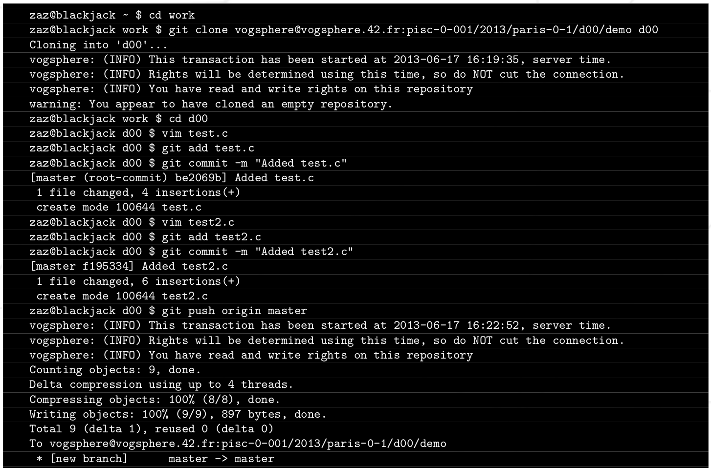
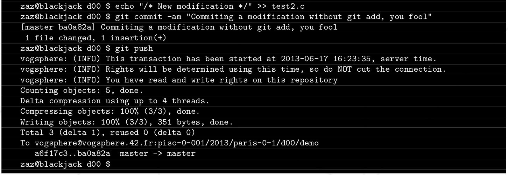

# Vogsphere - Руководство #

### Президентская форма для сдачи заявок ####

zaz zaz@staff.42.fr

Реферат: В этом руководстве объяснено, как использовать `Vogsphere`, так же известную как `встроенную систему 42`, включая основы `git`. `Git` - это программное обеспечение для управления версиями, используемое в `Vogsphere`.

# Глава I. Предисловие

> #### НИКОГДА НЕ ЖДИТЕ ДО ПОСЛЕДНЕЙ МИНУТЫ чтобы клонировать свой репозиторий и начать его использовать. Таким образом, если что-то пойдет не так, у вас будет достаточно времени, чтобы решить эту проблему.

> #### Пожалуйста, обратите внимание, что студенты, которые просят о помощи в отношении `Vogsphere` за несколько часов до закрытия хранилищ увидят у себя ответ что-то вроде `"Вы должны были прийти намного раньше!"`, И Они будут заслуживать такого ответа.

## I.1 Git
- Git — это распределенный менеджер управления версиями. Это инструмент, который мы используем для хранения версии изменений ваших файлов практически для каждого проекта в школе 42.
- Вы несете ответственность за приобретение знаний о `Git` и его использовании. Это руководство охватывает только очень ограниченный аспект этого `невероятного программного обеспечения`. Можно приобрести эти знания очень быстро, читая `документацию git` в Интернете. Это сэкономит вам много неприятностей.

## I.2 Источники

Вот несколько ссылок, где вы можете найти хорошее качество документации в отношении `Git`:

- Официальная документация: [git-scm.com](http://git-scm.com/documentation)
- Удивительная книга по Git [book_about_git.pdf](../Notes_to_help/book_about_git.pdf)
- [Знакомство с Git и GitHub: ч.1](https://nuancesprog.ru/p/5243/)
- [Знакомство с Git и GitHub: ч.2](https://nuancesprog.ru/p/5272/)
- [Git и Bash](https://nuancesprog.ru/p/4863/)

# Глава II. Операции в Vogsphere 

> #### С этого момента руководство считает, что вы прочитали документацию по `Git`.

## II.1 В кратце

- При регистрации в проекте автоматически создается уникальный и персональный репозиторий для вашей команды и для этого конкретного проекта.
- Вы можете найти `URL-адрес` вашего репозитория в `интрасети` на странице вашего проекта.
- `URL репозитория` будет выглядеть примерно так:

- Далее, вы должны сделать свежую копию вашего репозитория с помощью команды `git clone`.
- Далее, вы будете работать над этой локальной копией. После этого, или всякий раз, когда вы хотите уведомить Git о своей работе, вы должны:
  - Добавить изменения с помощью команды `git add`.
  - Cоздать новую пометку этих изменений с помощью команды `git commit`.
- Вы можете проверить состояние локального репозитория в любое время с помощью команды `git status`.
- Совершая свою работу шаг за шагом, вы можете создавать столько изменений, сколько хотите. Прочитайте документацию, чтобы понять, почему это хорошая идея, чтобы сделать это ...
- Чтобы отправить изменения на сторону `Vogsphere` (т.е. в репозиторий, который будет использоваться для оценок), необходимо использовать команду `git push`. При первой же отправке в репозиторий не забудьте указать пункт назначения (`git push origin master`).
- После успешной отправки все ваши изменения будут существовать уже и в копии `Vogsphere` вашего репозитория, и будут видны во время оценки.
- Очевидно, что любые ИЗМЕНЕНИЯ, СОЗДАННЫЕ в вашей локальной копии уже ПОСЛЕ отправки прошлых изменений, не будут существовать в копии `Vogsphere` вашего репозитория пока вы их туда самостоятельно не отправите, это (к счастью) не автоматически. Было бы стыдно усердно работать над проектом и забывать о его продвижении, не так ли? Последовательность команд:
  - `git add "file.c"`
  - `git commit -m "fix"`
  - `git push origin master`

- Если вы хотите в любое время проверить, то что было успешно сдано (то есть какие данные доступны в копии вашего репозитория `Vogsphere`), вы можете клонировать новую локальную копию вашего репозитория во временную папку. Этот клон будет точной копией того, что вы бы сдали, если бы оценка проводилась прямо сейчас.
- Когда вы работаете в команде (над некоторыми проектами или rush-ами), вы столкнетесь с проблемами синхронизации между локальной копией репозитория каждого члена команды. Существует несколько решений этой проблемы, которые подробно описаны в [документации Git](https://git-scm.com/doc) ...

## II.2 Пример

Вот краткий пример работы с репозиторием с помощью `Vogspere` (очевидно, URL-адреса ваших репозиториев будут отличаться):

## II.3 Пожалуйста, помните следующее

> #### Vogsphere применяет строгую квоту в 100 МБ на репозиторий. Будьте очень осторожны, поскольку превышение квоты будет рассматриваться как злоупотребление ресурсами и будет наказано как таковое!

- `Vogsphere` использует `билет Kerberos` для вашей аутентификации. Билет приобретается автоматически при входе в сеанс. Однако через некоторое время этот БИЛЕТ ИСТЕЧЕТ. Если ваш `билет Kerberos` истек и вы не можете использовать `Vogsphere`,то вы можете получить новый билет с помощью команды `kinit`.
- Репозитории для сдачи будут закрыты в точную дату и время его сдачи, которое указанно на странице вашего проекта во внутренней сети. У вас по-прежнему будет доступ для чтения к вашему репозиторию, но вы больше не сможете отправлять данные.
- Когда вы подключаетесь к `Vogsphere`, дата и время, используемые для проверки вашего доступа на запись к вашему репозиторию в `Vogsphere`, будут являтся датой и временем вашего подключения к Vogsphere. Если слишком много студентов попытаются отправить данные в одно и то же время, ваш запрос будет поставлен в очередь (`Vogsphere` уведомит вас). Не волнуйтесь, если вы не разорвали соединение или сделали ` git push` до истечения крайнего срока, ваше сообщение будет принято, если истекли дата и время подачи. Но в любом случае, кто может быть настолько глуп, чтобы сдать свою работу в последний момент ...
